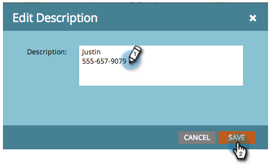

# Création d’une entrée dans la Vue de Planning du programme {#creating-an-entry-in-the-program-schedule-view}

Vous pouvez créer des entrées à partir de la vue de Planning du programme pour compléter un programme existant.

## Créer une entrée de base {#create-a-basic-entry}

1. Accédez à Activités **** marketing.

   

1. Sélectionnez votre programme. Cliquez sur la liste déroulante **Vue** . Sélectionnez **Planification**.

   

1. Cliquez sur un jour pour ajouter l’entrée à.

   

1. Nommez l’entrée. Appuyez sur **Entrée **pour confirmer le nom.

   

1. Sélectionnez le début et la date et l&#39;heure de fin de votre nouvelle entrée.

   

1. Cliquez sur l’icône de description pour ajouter des informations supplémentaires.

   

1. Saisissez votre description, puis cliquez sur **Enregistrer**.

   

1. Passez la souris sur l’icône de description pour vue à la description de l’entrée.

   

## Modifier le type d’entrée {#change-entry-type}

1. Sélectionnez une entrée de base dans la vue **Agenda** .

   

1. Sélectionnez la liste déroulante **Type** . Choisissez un nouveau type d’entrée.

   >[!NOTE]
   >
   >La tâche est une entrée personnalisée. Vous pouvez créer des tâches et d’autres entrées personnalisées pour vous aider à effectuer le suivi des points de l’ordre du jour non liés au marketing.

   

   Cool ! Vous devriez voir les modifications immédiatement.

   

>[!NOTE]
>
> Vous pouvez également créer une campagne  intelligente ou un programme [de](creating-a-new-email-program-in-the-schedule-view.md) courriel à partir de la vue de planification.

