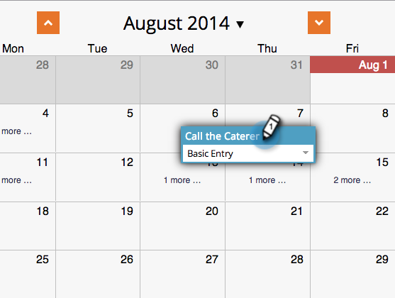
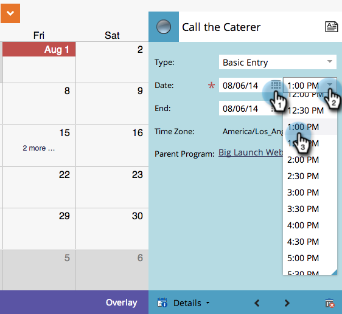
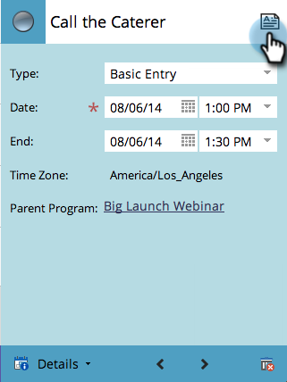
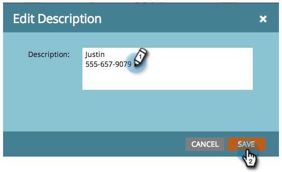
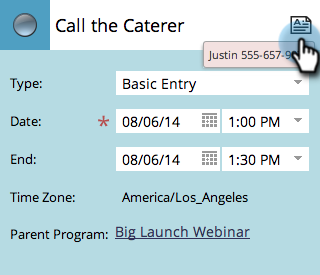
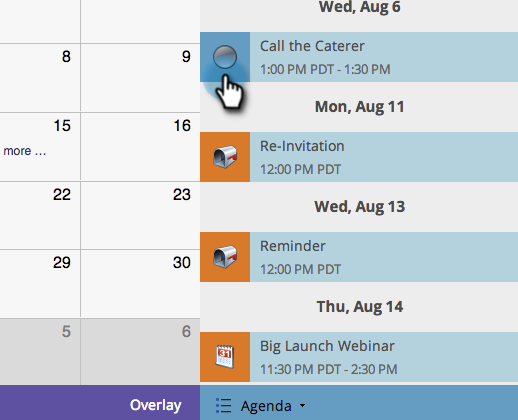
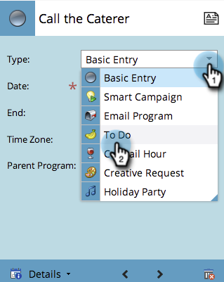
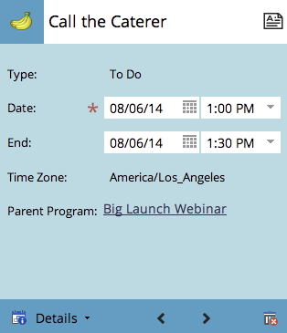

# Création d’une entrée dans la vue Planning du programme {#creating-an-entry-in-the-program-schedule-view}

Vous pouvez créer des entrées à partir de la vue de calendrier du programme pour compléter un programme existant.

## Créer une entrée de base {#create-a-basic-entry}

1. Accédez à **[!UICONTROL Activités marketing]**.

   

1. Sélectionnez votre programme. Cliquez sur la liste déroulante **[!UICONTROL Affichage]**. Sélectionnez **[!UICONTROL Planifier]**.

   

1. Cliquez sur un jour auquel ajouter l’entrée.

   

1. Nommez l’entrée. Appuyez sur **[!UICONTROL Entrée]** pour confirmer le nom.

   

1. Sélectionnez la date/l’heure de début et de fin de votre nouvelle entrée.

   

1. Cliquez sur l’icône de description pour ajouter des informations supplémentaires.

   

1. Saisissez votre description, puis cliquez sur **[!UICONTROL Enregistrer]**.

   

1. Pointez sur l’icône de description pour afficher la description de l’entrée.

   

## Modifier le type d&#39;entrée {#change-entry-type}

1. Sélectionnez une entrée de base dans la vue **[!UICONTROL Agenda]**.

   

1. Sélectionnez la liste déroulante **[!UICONTROL Type]**. Choisissez un nouveau type d&#39;entrée.

   >[!NOTE]
   >
   >A faire est une [entrée personnalisée](/help/marketo/product-docs/core-marketo-concepts/programs/program-schedule-view/create-custom-entry-types.md){target="_blank"}. Vous pouvez effectuer une tâche et d’autres entrées personnalisées pour effectuer le suivi des éléments de l’ordre du jour autres que Marketo.

   

   Les modifications doivent être visibles immédiatement.

   

>[!NOTE]
>
> Vous pouvez également créer une [campagne intelligente](/help/marketo/product-docs/core-marketo-concepts/programs/program-schedule-view/creating-a-batch-smart-campaign-in-the-program-schedule-view.md){target="_blank"} ou [programme d’e-mail](/help/marketo/product-docs/core-marketo-concepts/programs/program-schedule-view/creating-a-new-email-program-in-the-schedule-view.md){target="_blank"} à partir de la vue Planning.
