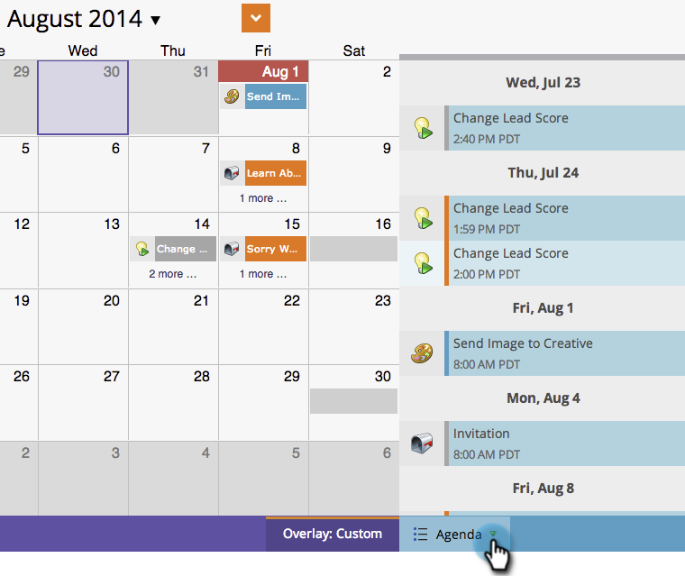

# Création d’incrustations personnalisées dans la Vue de Planning du programme {#creating-custom-overlays-in-program-schedule-view}

Vous pouvez créer des incrustations personnalisées pour les entrées de vue correspondant à vos besoins.

1. Cliquez sur la liste déroulante **Agenda**.

   

1. Sélectionnez **Overlays**.

   

1. Sélectionnez les types d’entrée que vous souhaitez voir dans votre incrustation.

   

1. Vous pouvez également filtrer par [balises de programme](/help/marketo/product-docs/core-marketo-concepts/programs/working-with-programs/understanding-tags/use-tags-in-a-program.md).

   

   Super. Désormais, l’incrustation n’affiche que les entrées que vous avez définies.

   
