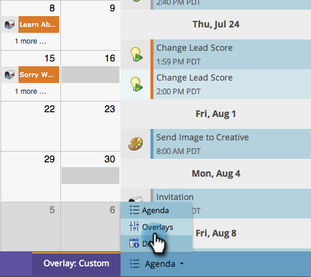
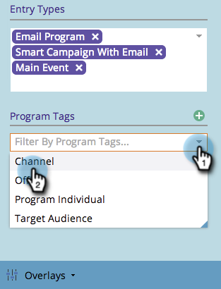

# Création de dispositions d’affichage personnalisées dans la vue Planning du programme {#creating-custom-overlays-in-program-schedule-view}

Vous pouvez créer des recouvrements personnalisés pour afficher les entrées appropriées à vos besoins.

1. Cliquez sur le menu déroulant **[!UICONTROL Ordre du jour]**.

   

1. Sélectionnez **[!UICONTROL Recouvrements]**.

   

1. Sélectionnez les [!UICONTROL types d’entrée] que vous souhaitez afficher dans votre recouvrement.

   

1. Vous pouvez également filtrer par [balises de programme](/help/marketo/product-docs/core-marketo-concepts/programs/working-with-programs/use-tags-in-a-program.md){target="_blank"}.

   

   Génial. Désormais, votre recouvrement n’affiche que les entrées que vous avez définies.

   
