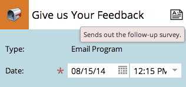

# Modification des entrées dans la Vue de Planning du programme {#editing-entries-in-the-program-schedule-view}

Vous pouvez apporter des modifications aux différents éléments de votre programme dans la vue de planification.

## Modifier le nom d’une entrée {#edit-an-entrys-name}

1. Sélectionnez l’entrée que vous souhaitez modifier.

   

1. Saisissez un nouveau nom et appuyez sur **Entrée/Retour** sur votre clavier pour confirmer la modification.

   

>[!CAUTION]
>
>Cela ne modifie que le nom d&#39;affichage dans la vue de planification. Le nom de la ressource dans votre programme reste identique.

## Modifier la description d’une entrée {#edit-an-entrys-description}

1. Cliquez sur l’icône de description.

   

1. Modifiez votre description. Cliquez sur **Enregistrer**.

   

1. Super ! Votre description a été modifiée.

   

## Modifier la date d’une entrée {#edit-an-entrys-date}

1. Sélectionnez la nouvelle date.

   

Vous faites du rock ! Maintenant, la date de votre inscription a été déplacée à une nouvelle date.

>[!NOTE]
>
> Les entrées de campagne intelligente et de programme électronique qui ont déjà été exécutées ne peuvent pas être déplacées par le passé.

