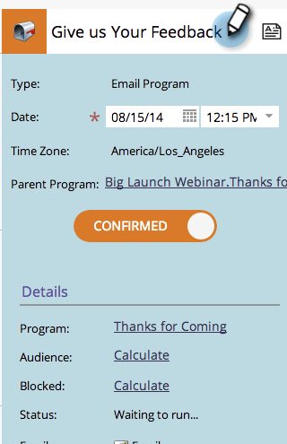

# Modification des entrées en mode Planification du programme {#editing-entries-in-the-program-schedule-view}

Vous pouvez apporter des modifications aux différents éléments de votre programme dans la vue Planning.

## Modification du nom d’une entrée {#edit-an-entrys-name}

1. Sélectionnez l’entrée que vous souhaitez modifier.

   

1. Saisissez un nouveau nom et appuyez sur **Entrée/Retour** sur votre clavier pour confirmer la modification.

   

>[!CAUTION]
>
>Cela modifie uniquement le nom d’affichage dans la vue de planification. Le nom de la ressource de votre programme reste le même.

## Modification de la description d’une entrée {#edit-an-entrys-description}

1. Cliquez sur l’icône de description.

   

1. Modifiez votre description. Cliquez sur **Enregistrer**.

   

1. Fantastique ! Votre description a maintenant été modifiée.

   

## Modification de la date d’une entrée {#edit-an-entrys-date}

1. Sélectionnez la nouvelle date.

   

Espèce de caillou ! La date de votre saisie a maintenant été déplacée vers une nouvelle date.

>[!NOTE]
>
> Les entrées de programme de campagne intelligente et de courrier électronique qui ont déjà été exécutées ne peuvent pas être déplacées vers le passé.
