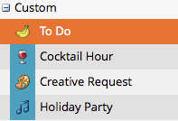

# Masquage et affichage des types d’entrée personnalisés {#hiding-and-unhiding-custom-entry-types}

Les types d’entrée personnalisés peuvent être masqués dans la section Admin. Une fois masqué, le type d’entrée ne s’affiche plus en tant qu’option.

## Masquer un type d’entrée personnalisé {#hide-a-custom-entry-type}

1. Accédez à la section **[!UICONTROL Admin]** et cliquez sur **[!UICONTROL Types d’entrée de calendrier]**.

   

1. Cliquez avec le bouton droit sur votre entrée personnalisée et cliquez sur **[!UICONTROL Masquer]**.

   

   Ce type d’entrée ne sera plus disponible.

## Afficher un type d’entrée personnalisé {#unhide-a-custom-entry-type}

Pour afficher un type d’entrée personnalisé :

1. Cliquez avec le bouton droit sur votre entrée et sélectionnez **[!UICONTROL Afficher]**.

   

   Le type d’entrée personnalisé est désormais visible.

   
