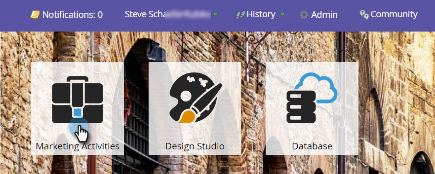

# Exécuter à nouveau une campagne intelligente dans la vue Planning du programme {#rerun-a-smart-campaign-in-the-program-schedule-view}

Les nouvelles exécutions d’une campagne dynamique existante peuvent être créées directement à partir de la vue de planning du programme.

1. Accédez à **[!UICONTROL Activités marketing]**.

   

1. Sélectionnez un programme contenant votre campagne intelligente.

   

1. Dans la vue de planification, cliquez sur le jour pour lequel vous souhaitez définir votre nouvelle exécution et donnez à votre entrée un nom facile à comprendre (par exemple, « Deuxième invitation »).

   

1. Sélectionnez le menu déroulant du type d’entrée, puis sélectionnez la campagne intelligente à réexécuter.

   

   >[!TIP]
   >
   >Vous pouvez également effectuer cette opération à partir de l’[objectif du programme](/help/marketo/product-docs/core-marketo-concepts/marketing-calendar/understanding-the-calendar/understand-enable-program-focus.md).

La campagne intelligente est maintenant planifiée pour une autre exécution. S’il contient des étapes d’envoi d’e-mail, elles s’affichent également ici.
