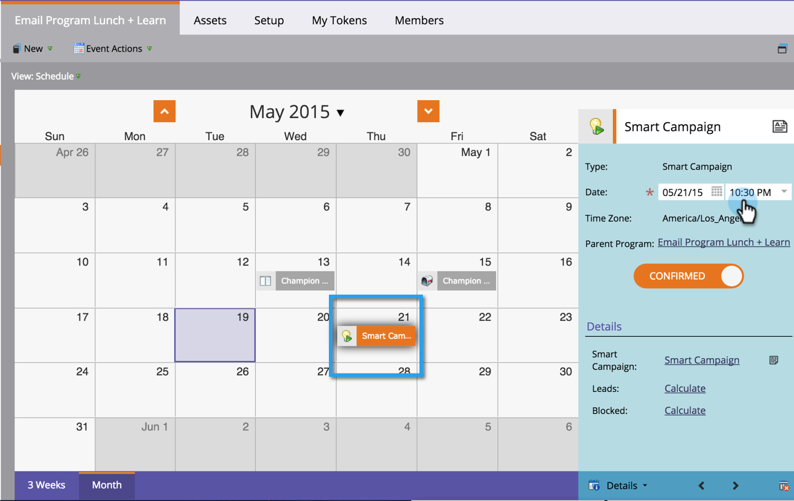

# Replanifier une Campaign Smart par lot dans la Vue de Planning du programme {#reschedule-a-batch-smart-campaign-in-the-program-schedule-view}

Souhaitez-vous replanifier une exécution de campagne par lot intelligente ? Faites-les glisser dans le futur dans la vue de Planning du programme.

1. Sélectionnez la campagne intelligente que vous souhaitez replanifier.

   

1. Faites glisser et déposez jusqu’à la nouvelle date d’exécution de la campagne. 

1. Super ! La campagne intelligente a été replanifiée. L’heure peut également être modifiée à partir de la liste déroulante **Date** dans les détails de l’entrée.

   

>[!NOTE]
>
>**Articles connexes**
>
>[Replanifier un Programme entier à partir de la Vue de planification](rescheduling-an-entire-program-from-the-schedule-view.md)

