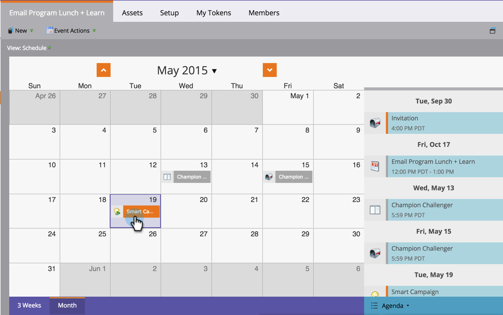
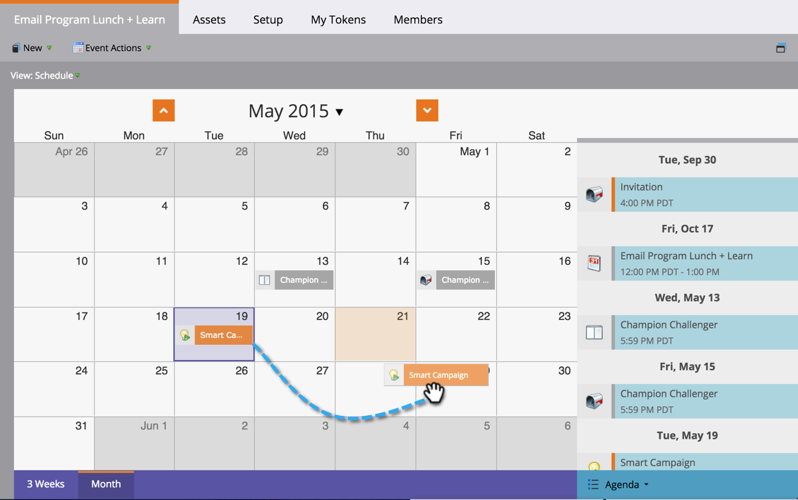

# Replanifier une campagne intelligente par lots dans la vue Planning du programme {#reschedule-a-batch-smart-campaign-in-the-program-schedule-view}

Vous souhaitez replanifier une exécution de campagne par lots ? Effectuez un glisser-déposer dans le futur dans la vue de planning du programme.

1. Sélectionnez la campagne intelligente à replanifier.

   

1. Effectuez un glisser-déposer vers la nouvelle date à laquelle vous souhaitez que la campagne s’exécute.

1. La campagne intelligente a été replanifiée. L’heure peut également être modifiée à partir de la liste déroulante **[!UICONTROL Date]** dans les détails de l’entrée.

   

>[!MORELIKETHIS]
>
>[Replanification d’un programme entier à partir de la vue Planification](/help/marketo/product-docs/core-marketo-concepts/programs/program-schedule-view/rescheduling-an-entire-program-from-the-schedule-view.md){target="_blank"}
