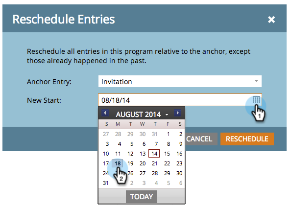
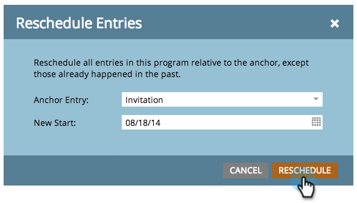

# Replanification de l’ensemble d’un programme à partir de la vue Planning {#rescheduling-an-entire-program-from-the-schedule-view}

Lorsque vous clonez un programme ou un événement avec des dates, vous souhaiterez probablement replanifier toutes les dates en même temps. Voici comment faire.

1. Sélectionnez le programme à replanifier.

   

1. Sélectionnez le menu déroulant Action d’événement . Choisissez **[!UICONTROL Replanifier les écritures]**.

   

1. Sélectionnez une [!UICONTROL Entrée d’ancrage]. En fonction de ce déplacement, toutes les autres entrées se déplaceront avec lui.

   

1. Choisissez la date [!UICONTROL Nouveau début].

   

1. Cliquez sur **[!UICONTROL Replanifier]**.

   

1. Nos récupérateurs de données désapprouveront, replanifieront et réapprouveront alors toutes vos ressources avec les dates correctes.

   

>[!NOTE]
>
>Les Assets déjà exécutées ne seront pas déplacées.

Tout est maintenant reprogrammé. Ajustez les dates spécifiques selon les besoins.

