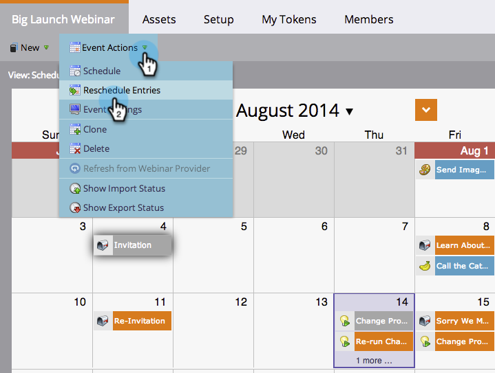

# Replanification d’un programme entier à partir de la vue de planification {#rescheduling-an-entire-program-from-the-schedule-view}

Lorsque vous clonez un programme ou un événement avec des dates, il est probable que vous souhaitiez replanifier toutes les dates en même temps. Voici comment.

1. Sélectionnez le programme que vous souhaitez reprogrammer.

   

1. Sélectionnez la liste déroulante Action d’événement . Choisir **[!UICONTROL Replanifier les entrées]**.

   

1. Sélectionnez une entrée d’ancrage. Selon ce déplacement, toutes les autres entrées seront déplacées avec celui-ci.

   

1. Sélectionnez la nouvelle date de début.

   

1. Cliquez sur **[!UICONTROL Replanifier]**.

   

1. Nos récupérateurs de données désapprouveront, reprogrammeront et réapprouveront alors toutes vos ressources avec les dates correctes !

   

>[!NOTE]
>
>Les ressources déjà exécutées ne se déplacent pas.

Tout est maintenant reprogrammé. Ajustez des dates spécifiques si nécessaire.

