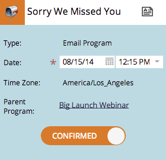
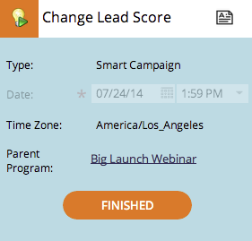

# Présentation des dates provisoires/confirmées {#understanding-tentative-confirmed-dates}

Les campagnes dynamiques et les programmes de messagerie électronique disposent d’une puissante capacité à être marqués comme **Tentative** ou **Confirmé**. Voici comment ils fonctionnent.

## Tentative {#tentative}

Les dates provisoires véhiculent une intention. Pensez à ça comme si c&#39;était &quot;un crayon&quot; dans le calendrier. Les entrées provisoires ne s&#39;exécuteront pas - ce sont des espaces réservés uniquement.

>[!NOTE]
>
>Seules les campagnes dynamiques par lot et les programmes électroniques peuvent être provisoires.

## Confirmation des entrées {#confirming-entries}

Il s’agit de l’approbation d’un actif. Les entrées doivent donc être entièrement configurées avant de pouvoir les confirmer. Une fois que tous vos canards se trouvent sur une rangée, vous pouvez confirmer les entrées en glissant l&#39;onglet provisoire vers la droite.

   

>[!NOTE]
>
>Pourquoi le chien ? C&#39;est un Golden Retriever. Il récupère vos données.

## {#confirmed} confirmé

Les entrées confirmées seront certainement exécutées. Ils disposent de règles, d’actifs approuvés et d’une date et d’une heure confirmées.

## {#finished} terminé

Les entrées terminées ont déjà été exécutées. Ils ne peuvent être que dans le passé (évidemment). Une fois qu&#39;une entrée a été exécutée et est **Terminée**, vous ne pouvez pas la déplacer ou la faire titiller. (Pas de changement de la réalité et de rupture du continuum du temps.)

Ces États constituent de puissants outils. Lorsque vous cloner un programme, toutes les dates de campagne intelligente et de programme électronique seront provisoires. Ils peuvent tous être confirmés à partir de la vue de calendrier. Cool, non ?
