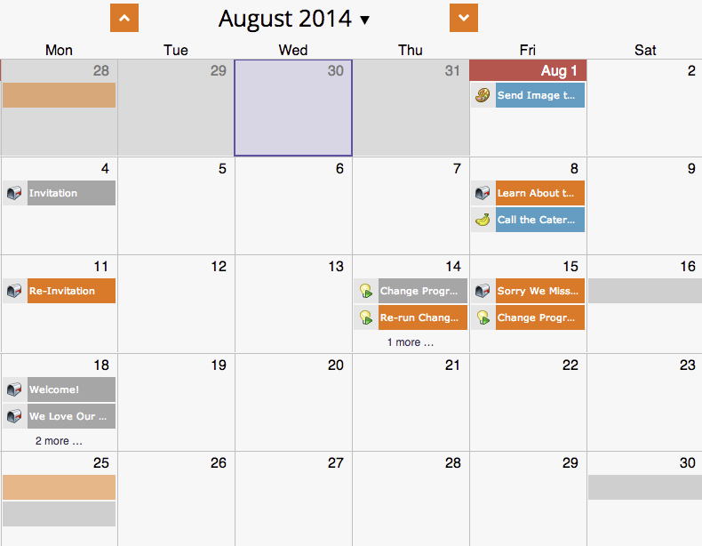

# Utilisation d’une incrustation globale {#using-a-global-overlay}

L’incrustation globale dans la vue de Planning du programme vous permet d’afficher votre programme par rapport à d’autres ressources planifiées.

>[!PREREQUISITES]
>
>Vous devez disposer d’une licence [de calendrier](../../../../product-docs/core-marketo-concepts/marketing-calendar/understanding-the-calendar/issue-revoke-a-marketing-calendar-license.md) marketing pour utiliser cette fonction.

## Utilisation de l’incrustation globale {#use-the-global-overlay}

1. Sélectionnez votre programme.

   

1. Sélectionnez **Incrustation** dans le coin inférieur droit.

   

1. Les blocs solides représentent les entrées à cette date. Cliquez pour afficher les détails.

   

   Les détails de l’entrée pour les éléments d’incrustation seront en lecture seule. Cliquez sur le programme parent pour apporter des modifications.

   

## Utilisation d’un filtre enregistré comme incrustation {#use-a-saved-filter-as-an-overlay}

Si vous avez [enregistré un filtre dans le calendrier](../../../../product-docs/core-marketo-concepts/marketing-calendar/working-with-the-calendar/saving-a-filter-definition-in-the-marketing-calendar.md)marketing, vous pouvez l’utiliser comme incrustation dans la vue de Planning du programme.

1. Cliquez sur la liste déroulante **Incrustation** et sélectionnez votre définition de filtre.

   

   C&#39;est facile ! Vous verrez maintenant une incrustation définie par le filtre que vous avez enregistré et sélectionné.

   

   >[!NOTE]
   >
   >**Articles connexes**
   >
   >    
   >    
   >    * [Création d’incrustations personnalisées dans la Vue de Planning du programme](creating-custom-overlays-in-program-schedule-view.md)

