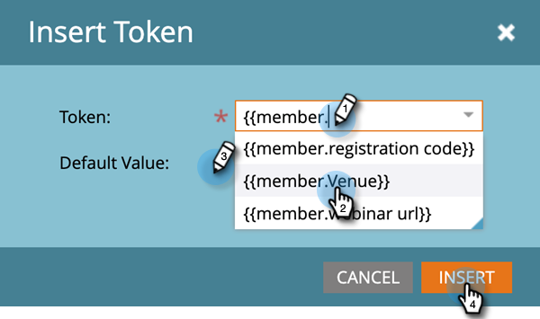
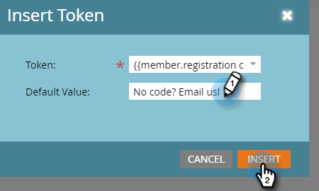
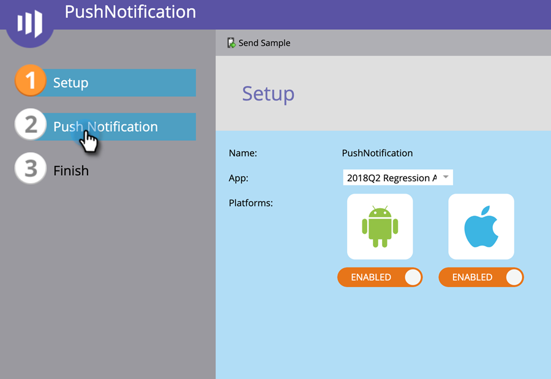

# Jetons de champ personnalisés des membres du programme {#program-member-custom-field-tokens}

## Prise en charge des jetons pour les champs personnalisés des membres du programme {#token-support-for-program-member-custom-fields}

Au verso des fonctionnalités Champs personnalisés des membres de programme , la prise en charge des champs personnalisés des membres de programme est étendue dans les structures de jeton.

Les jetons PMCF seront pris en charge sous le domaine membre de la famille de jetons.

Les jetons de membre sont utilisés pour les champs appartenant au champ Program Member . À partir de l’état actuel, les jetons de membre sont également utilisés pour insérer des valeurs uniques provenant des partenaires de services intégrés. `{{member.webinar url}}` le jeton résout automatiquement l’URL de confirmation unique de la personne générée par le fournisseur de services. {{member.registration code}} correspond au code d’enregistrement fourni par le fournisseur de services.

>[!NOTE]
>
>* Les champs personnalisés des membres du programme ne peuvent être utilisés que dans le contexte d’un programme.
>* Les jetons de champ personnalisés d’un membre de programme ne peuvent pas être utilisés dans : en-tête d’email, Jetons de date dans les étapes d’attente ou Fragments de code.
>* Le statut de membre du programme n’est pas pris en charge dans les jetons de membre.

## Utilisation de jetons de champ personnalisés de membre de programme dans Assets {#using-program-member-custom-field-tokens-in-assets}

Vous pouvez insérer des jetons de champs personnalisés membres du programme dans les emails, les landing pages, les SMS, les notifications push et les webhooks.

**E-mails**

1. Sélectionnez l’adresse électronique de votre choix, puis cliquez sur **[!UICONTROL Modifier le brouillon]**.

   

1. Cliquez sur l&#39;icône Insérer un jeton .

   

1. Recherchez et sélectionnez le jeton de champ personnalisé de membre du programme de votre choix, saisissez une valeur par défaut, puis cliquez sur **[!UICONTROL Insérer]**.

   

1. Cliquez sur **[!UICONTROL Enregistrer]**.

   

>[!NOTE]
>
>N&#39;oubliez pas d&#39;approuver votre email.

**Pages de destination**

1. Sélectionnez votre page d’entrée, puis cliquez sur **[!UICONTROL Modifier le brouillon]**.

   

   >[!NOTE]
   >
   >Le concepteur de landing page s’ouvre dans une nouvelle fenêtre.

1. Double-cliquez sur la zone de texte enrichi à laquelle vous souhaitez ajouter le jeton.

   

1. Cliquez à l’emplacement où vous souhaitez que le jeton soit, puis cliquez sur l’icône Insérer un jeton .

   

1. Recherchez et sélectionnez le jeton souhaité.

   

1. Saisissez une valeur par défaut, puis cliquez sur **[!UICONTROL Insérer]**.

   

1. Cliquez sur **[!UICONTROL Enregistrer]**.

   

**SMS**

1. Sélectionnez le SMS souhaité, puis cliquez sur **[!UICONTROL Modifier le brouillon]**.

   

1. Cliquez sur le bouton **`{{ Token`** bouton .

   

1. Recherchez et sélectionnez le jeton de champ personnalisé de membre du programme souhaité. Saisissez une valeur par défaut et cliquez sur Insérer.

   

1. Cliquez sur la liste déroulante Actions SMS et sélectionnez **[!UICONTROL Approuver et fermer]**.

   

**Notifications Push**

1. Sélectionnez la notification push souhaitée, puis cliquez sur **[!UICONTROL Modifier le brouillon]**.

   

1. Cliquez sur **[!UICONTROL Notification push]**.

   

1. Cliquez sur le message dans l’éditeur, puis sur le bouton `{{` pour obtenir le sélecteur de jetons.

   

1. Recherchez et sélectionnez le jeton de champ personnalisé de membre du programme souhaité. Saisissez une valeur par défaut et cliquez sur **[!UICONTROL Insérer]**.

   

1. Cliquez sur **[!UICONTROL Terminer]** pour enregistrer et quitter (ou **[!UICONTROL Suivant]** pour la première fois).

   

>[!NOTE]
>
>Si le champ personnalisé de membre du programme d’un membre du programme n’a pas de valeur, le jeton est remplacé par la valeur par défaut si elle a été fournie.

## Utilisation de jetons de champ personnalisés de membre de programme dans les campagnes {#using-program-member-custom-field-tokens-in-campaigns}

Les jetons de champ personnalisés de membre de programme peuvent être utilisés dans :

* Créer une tâche
* Créer une tâche dans Microsoft
* Moments significatifs
* Modification des actions de flux de valeur de données
* Webhooks
