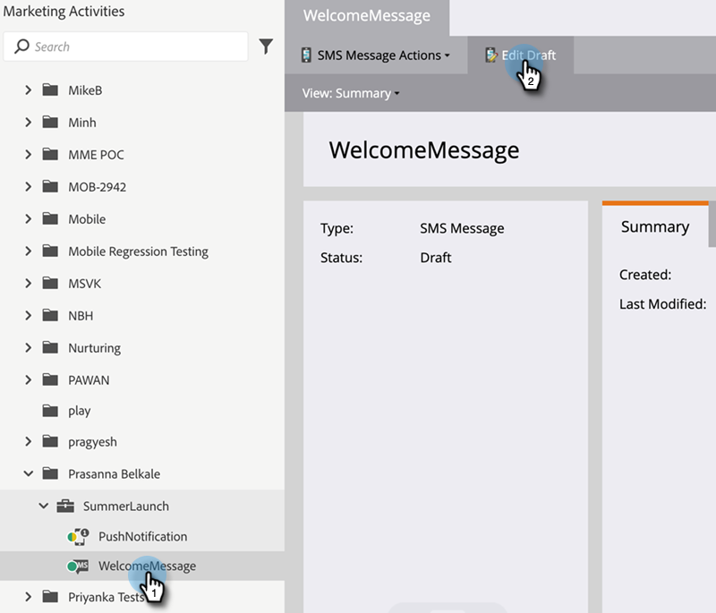

# Jetons de champs personnalisés de personnes membres du programme {#program-member-custom-field-tokens}

## Prise en charge des jetons pour les champs personnalisés des membres de programme {#token-support-for-program-member-custom-fields}

À l’arrière des fonctionnalités de champs personnalisés de membre de programme, la prise en charge des champs personnalisés de membre de programme est étendue dans les structures de jetons.

Les jetons PMCF seront pris en charge sous le domaine membre de la famille de jetons.

Les jetons de membre sont utilisés pour les champs relevant du champ d’application du membre de programme. À partir de l’état actuel, les jetons de membre sont également utilisés pour insérer des valeurs uniques provenant de partenaires de services intégrés. `{{member.webinar url}}` jeton résout automatiquement l’URL de confirmation unique de la personne générée par le fournisseur de services. {{member.registration code}} est résolu sur le code d’enregistrement fourni par le fournisseur de services.

>[!NOTE]
>
>* Les champs personnalisés de membre de programme ne peuvent être utilisés que dans le contexte d’un programme.
>* Les jetons de champs personnalisés de membre de programme ne peuvent pas être utilisés dans : le pré-titre des e-mails, les jetons de date dans les étapes d’attente ou les fragments de code.
>* Le statut de membre du programme n’est pas pris en charge dans les jetons de membre.

## Utilisation de jetons de champ personnalisé de membre de programme dans Assets {#using-program-member-custom-field-tokens-in-assets}

Vous pouvez insérer des jetons de champs personnalisés de membre de programme dans les e-mails, les landing pages, les SMS, les notifications push et les Webhooks.

**E-mails**

1. Sélectionnez l’e-mail souhaité, puis cliquez sur **[!UICONTROL Modifier le brouillon]**.

   

1. Cliquez sur l’icône Insérer un jeton .

   

1. Recherchez et sélectionnez le jeton de champ personnalisé Membre de programme souhaité, saisissez une valeur par défaut, puis cliquez sur **[!UICONTROL Insérer]**.

   

1. Cliquez sur **[!UICONTROL Enregistrer]**

   

>[!NOTE]
>
>N’oubliez pas d’approuver votre e-mail.

**Pages de destination**

1. Sélectionnez votre page de destination et cliquez sur **[!UICONTROL Modifier le brouillon]**.

   

   >[!NOTE]
   >
   >Le concepteur de page de destination s’ouvre dans une nouvelle fenêtre.

1. Double-cliquez sur la zone de texte enrichi à laquelle vous souhaitez ajouter le jeton.

   

1. Cliquez à l’endroit où vous souhaitez placer le jeton, puis cliquez sur l’icône Insérer un jeton .

   

1. Recherchez et sélectionnez le jeton souhaité.

   

1. Saisissez une valeur par défaut et cliquez sur **[!UICONTROL Insérer]**.

   

1. Cliquez sur **[!UICONTROL Enregistrer]**

   

**SMS**

1. Sélectionnez le SMS souhaité, puis cliquez sur **[!UICONTROL Modifier le brouillon]**.

   

1. Cliquez sur le bouton **`{{ Token`** .

   

1. Recherchez et sélectionnez le jeton de champ personnalisé Membre de programme souhaité. Saisissez une [!UICONTROL valeur par défaut] puis cliquez sur **[!UICONTROL Insérer]**.

   

1. Cliquez sur le menu déroulant Actions SMS et sélectionnez **[!UICONTROL Approuver et fermer]**.

   

**Notifications push**

1. Sélectionnez la notification push souhaitée et cliquez sur **[!UICONTROL Modifier le brouillon]**.

   

1. Cliquez sur **[!UICONTROL Notification push]**.

   

1. Cliquez sur le message dans l’éditeur, puis sur le bouton `{{` pour obtenir le sélecteur de jeton.

   

1. Recherchez et sélectionnez le jeton de champ personnalisé Membre de programme souhaité. Saisissez une valeur par défaut et cliquez sur **[!UICONTROL Insérer]**.

   

1. Cliquez sur **[!UICONTROL Terminer]** pour enregistrer et quitter (ou **[!UICONTROL Suivant]** pour réviser en premier).

   

>[!NOTE]
>
>Si le champ personnalisé de membre de programme d’un membre du programme n’a pas de valeur, le jeton sera remplacé par la valeur par défaut s’il a été fourni.

## Utilisation de jetons de champ personnalisé de membre de programme dans les campagnes {#using-program-member-custom-field-tokens-in-campaigns}

Les jetons de champ personnalisé de membre de programme peuvent être utilisés dans :

* Créer une tâche
* Créer une tâche dans Microsoft
* Moments intéressants
* Actions de flux Modifier la valeur de données
* Webhooks
