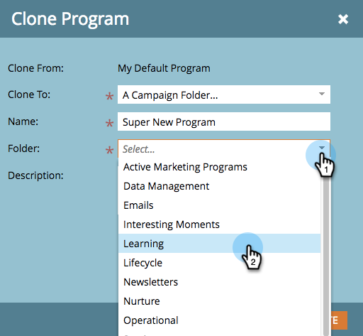
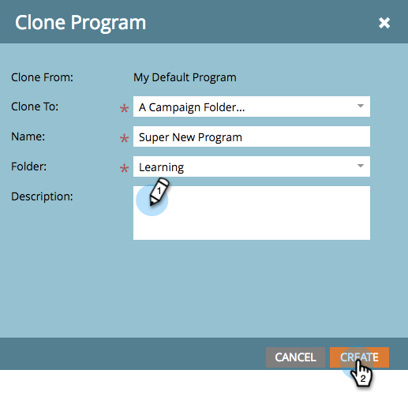

# Cloner un programme {#clone-a-program}

Clonez un programme entier et toutes ses ressources au lieu de tout reconstruire manuellement.

1. Recherchez et sélectionnez le programme à cloner. Dans la liste déroulante **[!UICONTROL Actions de programme]**, cliquez sur **[!UICONTROL Cloner]**.

   

1. Sélectionnez l’emplacement vers lequel vous souhaitez cloner votre programme.

   >[!NOTE]
   >
   >Les programmes peuvent être clonés dans [campaign](/help/marketo/product-docs/core-marketo-concepts/miscellaneous/create-new-campaign-folder.md) [dossiers](/help/marketo/product-docs/core-marketo-concepts/miscellaneous/create-new-campaign-folder.md) ou [espaces de travail](/help/marketo/product-docs/administration/workspaces-and-person-partitions/create-a-new-workspace.md). Vérifiez toutes les ressources dépendantes sous-jacentes (e-mails, fragments de code, modèles de page de destination, etc.) sont partagées avec l’espace de travail de destination avant le clonage.

   

   >[!NOTE]
   >
   >Vous voyez cette [!UICONTROL NOTE] dans la capture d’écran ci-dessus ? Cela signifie que si vous clonez un programme contenant 1 000 personnes ou plus dans une liste, la liste elle-même sera clonée, mais elle sera vide. Si vous clonez un programme avec une liste contenant 999 personnes ou moins, cette liste, ainsi que tous ses membres, apparaîtront dans le programme cloné.

1. Saisissez un **[!UICONTROL Nom]**.

   

1. Choisissez le dossier de destination.

   

1. Ajoutez une description facultative, puis cliquez sur **[!UICONTROL Créer]**.

   

   >[!TIP]
   >
   >Utilisez cette technique avec des jetons pour accélérer la création de nouveaux programmes.

   >[!CAUTION]
   >
   >Les coûts de la période ne seront pas transférés. Assurez-vous donc que est ajouté au programme cloné s’il a été défini dans l’original.
