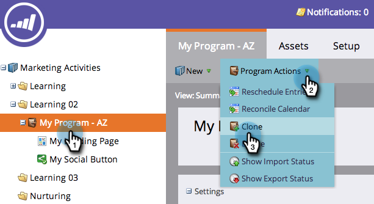

# Cloner un programme {#clone-a-program}

Clonez rapidement et facilement un programme entier et toutes ses ressources au lieu de tout reconstruire manuellement.

1. Recherchez et sélectionnez le programme à cloner. Dans la liste déroulante **[!UICONTROL Actions de programme]**, cliquez sur **[!UICONTROL Cloner]**.

   

1. Sélectionnez l’emplacement vers lequel vous souhaitez cloner votre programme.

   >[!NOTE]
   >
   >Les programmes peuvent être clonés dans [campaign](/help/marketo/product-docs/core-marketo-concepts/miscellaneous/create-new-campaign-folder.md) [dossiers](/help/marketo/product-docs/core-marketo-concepts/miscellaneous/create-new-campaign-folder.md) ou [espaces de travail](/help/marketo/product-docs/administration/workspaces-and-person-partitions/create-a-new-workspace.md). Assurez-vous de partager toutes les ressources dépendantes sous-jacentes (e-mails, fragments de code, modèles de page de destination, etc.) avec l’espace de travail de destination avant de cloner.

   

   >[!NOTE]
   >
   >Vous voyez cette [!UICONTROL NOTE] dans la capture d’écran ci-dessus ? Cela signifie que si vous clonez un programme contenant 1 000 personnes ou plus dans une liste, la liste elle-même sera clonée, mais elle sera vide. Si vous clonez un programme avec une liste contenant 999 personnes ou moins, cette liste, ainsi que tous ses membres, apparaîtront dans le programme cloné.

1. Saisissez un **[!UICONTROL Nom]**.

   

1. Choisissez le dossier vers lequel vous souhaitez cloner votre programme.

   

1. Ajoutez une description facultative, puis cliquez sur **[!UICONTROL Créer]**. Regardez à quelle vitesse vous avez pu créer un nouveau programme avec toutes ses ressources prêtes à l’emploi !

   

   >[!TIP]
   >
   >Utilisez cette technique avec des jetons pour rendre la création de programme instantanée.

   >[!CAUTION]
   >
   >Les coûts de la période ne seront pas transférés. Veillez donc à ajouter cela à votre programme cloné si vous en aviez un défini dans l’original.
