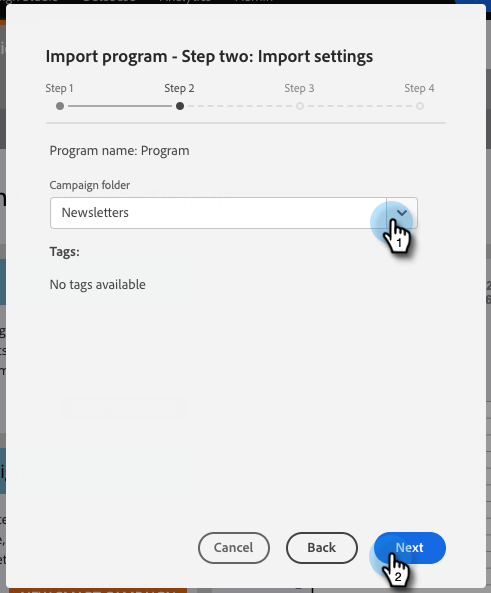
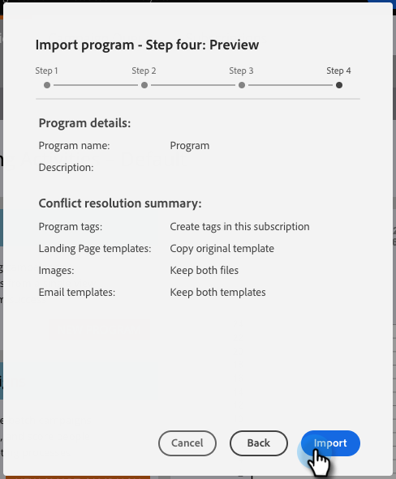

# Importer un programme {#import-a-program}

Un programme peut être importé d’un abonnement Marketo Engage à un autre. Par exemple, vous pouvez créer un programme dans un sandbox, puis l’importer dans votre abonnement en direct. Vous pouvez également importer un programme préconfiguré à partir de la bibliothèque de programmes [Marketo](/help/marketo/product-docs/core-marketo-concepts/programs/program-library/program-import-library-overview.md){target="_blank"}.

>[!CAUTION]
>
>
>* Lors de l’importation d’un programme, les e-mails/pages de destination contenant des fragments de code ou du [contenu dynamique](/help/marketo/product-docs/personalization/segmentation-and-snippets/segmentation/understanding-dynamic-content.md){target="_blank"} sont ignorés.
>
>* Les programmes dont les listes dynamiques contiennent un déclencheur « L’objet personnalisé est mis à jour » entraînent l’échec de l’importation. Supprimez ce déclencheur de toutes les listes dynamiques avant de suivre les étapes décrites ci-dessous.

## Importation d’un programme {#importing-a-program}

1. Accédez à **[!UICONTROL Activités marketing]**.

   

1. Cliquez sur la liste déroulante **[!UICONTROL Nouveau]** et sélectionnez **[!UICONTROL Importer un programme]**.

   

   >[!NOTE]
   >
   >* L’importation de programme est uniquement disponible pour les utilisateurs dont les rôles disposent de l’autorisation Importer un programme activée. En savoir plus sur la [gestion des rôles utilisateur et des autorisations](/help/marketo/product-docs/administration/users-and-roles/managing-user-roles-and-permissions.md){target="_blank"}.
   >
   >* Pour connecter un compte sandbox à votre abonnement en direct, contactez l’assistance Marketo [&#128279;](https://nation.marketo.com/t5/Support/ct-p/Support){target="_blank"}.

1. Sélectionnez un Marketo **[!UICONTROL abonnement]** et un programme à importer. Cliquez sur **[!UICONTROL Suivant]**.

   

1. Spécifiez un **[!UICONTROL dossier Campaign]** pour le programme importé. Cliquez sur **[!UICONTROL Suivant]**.

   

   >[!NOTE]
   >
   >Assurez-vous que **[!UICONTROL Utiliser le conflit par défaut]** règles est sélectionné. Les règles de conflit sont nécessaires lorsque vous importez des programmes dans une instance qui contient des ressources du même nom.

1. Choisissez les détails du conflit de votre choix et cliquez sur **[!UICONTROL Suivant]**.

   

   >[!NOTE]
   >
   >Lors de l’importation d’un programme qui utilise des étapes de flux personnalisées ou des règles de liste dynamique dérivées d’un service d’étape de flux dans une instance de destination où il existe plusieurs fournisseurs de services compatibles, l’utilisateur importateur est invité à affecter des étapes ou des règles au fournisseur de services approprié dans l’instance de destination.

1. Prévisualisez les détails et **[!UICONTROL Importez]** le programme.

   

Vous recevrez une confirmation par e-mail une fois l’importation terminée.

>[!NOTE]
>
>Vous devez replanifier les campagnes par lots importées et activer les campagnes de déclenchement. Le système désactive automatiquement les plannings de campagne et déclenche des campagnes dans le programme importé.

## Impact sur Assets externe lors des importations de programmes {#impact-on-external-assets-during-program-imports}

Les programmes utilisent des ressources externes telles que des modèles d’e-mail, de page de destination, des images, des formulaires, des jetons et des balises de programme. Vous pouvez configurer la manière dont les modèles de page de destination et les balises de programme sont gérés et Marketo gère automatiquement le reste.

**Modèles d’e-mail/de page de destination :** les modèles d’e-mail/de page de destination sont importés dans Design Studio. Vous pouvez utiliser des règles de conflit pour configurer le comportement lorsqu’un modèle portant le même nom existe. En utilisant la règle par défaut, un nombre est ajouté à un modèle s’il en existe un portant le même nom. Par exemple, si vous avez déjà un modèle nommé « Modèle standard », le nouveau modèle s’appellera « Modèle standard - 1 ».

**Pages de destination/Forms :** si un formulaire ou une page de destination portant le même nom existe dans Design Studio, ils seront tout de même importés, mais avec un numéro ajouté à leur nom (par exemple : Page de destination - 1).

**Images :** les images utilisées par les landing pages sont importées dans design studio, sauf si elles portent le même nom.

**Jetons :** les jetons qui ne font pas partie d’un programme sont convertis en jetons locaux au cours du processus d’importation.

>[!CAUTION]
>
>Le type d’image Mes jetons ne sont pas pris en charge pour les importations de programme. Si un programme dont le type d’image est Mes jetons est importé, les jetons _no_ ne passeront pas.

**Balises de programme :** vous pouvez utiliser des règles de conflit pour contrôler le traitement des balises de programme qui n’existent pas dans le compte de destination. L’utilisation de la règle par défaut crée les balises du programme, ou vous pouvez choisir d’ignorer les balises.
