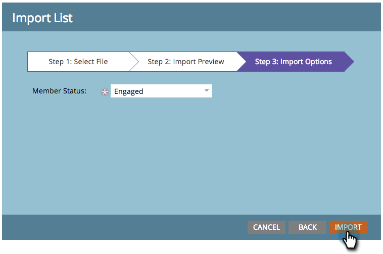

# Importer les membres d&#39;une feuille de calcul dans un programme {#import-members-from-a-spreadsheet-into-a-program}

Vous pouvez importer une liste de personnes qui deviennent automatiquement membres d’un programme. Voici ce qu&#39;il faut faire.

## Préparation de votre fichier CSV {#prepare-your-csv-file}

1. Créez un fichier CSV standard dans [!DNL Excel], comme dans l’exemple ci-dessous.

   

   >[!CAUTION]
   >
   >Lors de l’importation d’une date dans un champ de date, utilisez le format suivant : 9/29/24 (Mois/Jour/Année).

## Importation de votre fichier CSV dans Marketo {#import-your-csv-into-marketo}

1. Dans votre programme, accédez à la section **[!UICONTROL Membres]**.

   

1. Cliquez sur **[!UICONTROL Importer des membres]**.

   

1. Sélectionnez le fichier CSV et cliquez sur **[!UICONTROL Suivant]**.

   

1. Mappez les valeurs de données de la liste aux champs Marketo correspondants, puis cliquez sur **[!UICONTROL Suivant]**.

   

   >[!NOTE]
   >
   >Si vous ne souhaitez pas importer certains champs, sélectionnez **[!UICONTROL IGNORER]** dans le menu déroulant Champ Marketo .

1. Sélectionnez le **[!UICONTROL Statut du membre]** pour votre liste.

   

1. Cliquez sur **[!UICONTROL Importer]**.

   

1. Patientez jusqu’à la fin de l’importation de Marketo, puis fermez la boîte de dialogue de confirmation.

   

   Fantastique ! Vous devriez voir les nouveaux membres que vous avez importés.

   

>[!MORELIKETHIS]
>
>[Gérer et afficher les membres](/help/marketo/product-docs/core-marketo-concepts/programs/working-with-programs/manage-and-view-members.md){target="_blank"}
