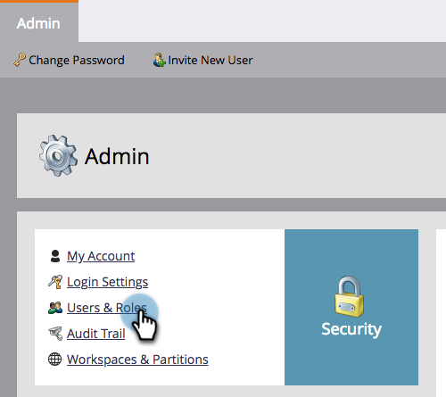
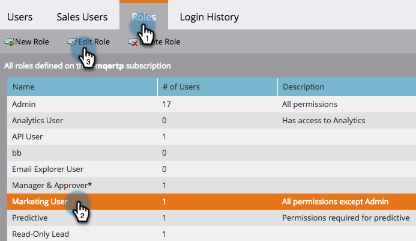
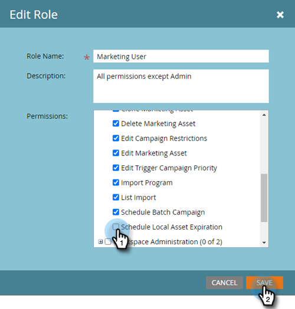
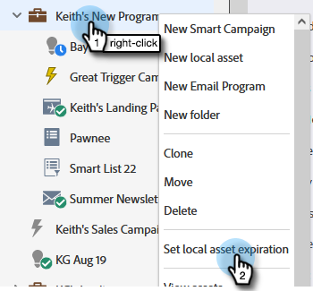
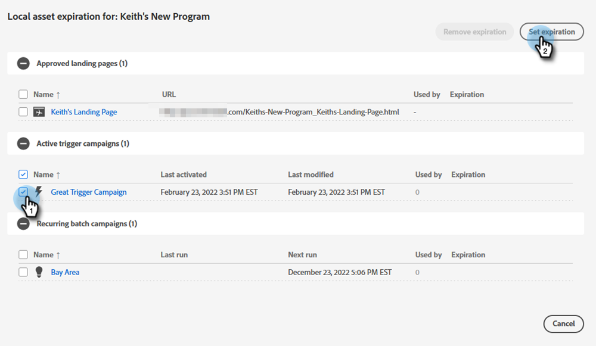
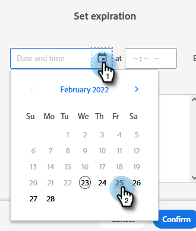
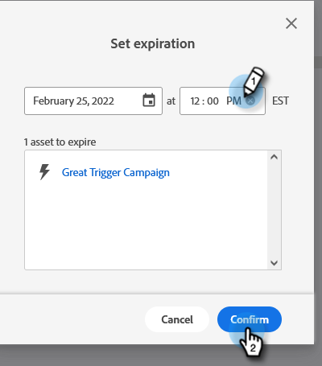
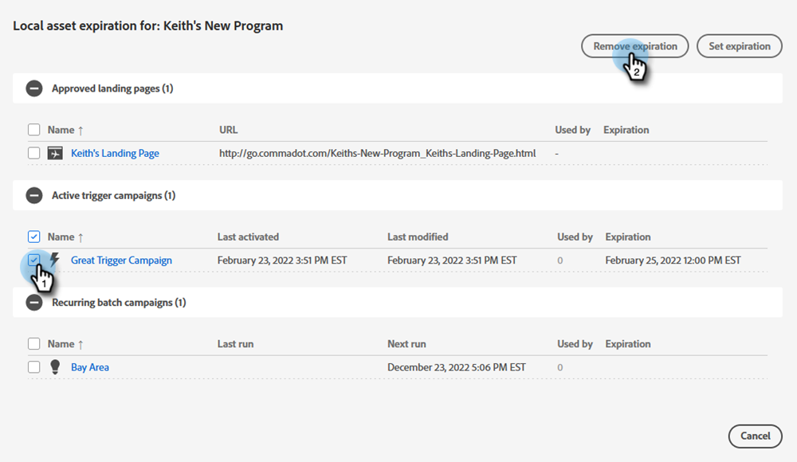
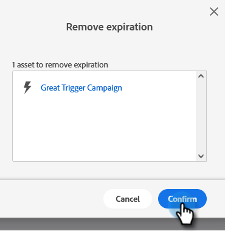

# Expiration des ressources locales {#local-asset-expiration}

Définissez une date/heure d’expiration pour dépublier des pages de destination, désactiver les campagnes de déclenchement ou arrêter les campagnes par lots récurrentes.

## Octroyer l’autorisation d’expiration des ressources de planification {#grant-schedule-asset-expiration-permission}

Avant de pouvoir planifier l’expiration d’une ressource, votre rôle Marketo doit disposer de l’autorisation appropriée activée.

>[!NOTE]
>
>**Autorisations d’administration requises**

1. Dans la zone [!UICONTROL Admin], cliquez sur **[!UICONTROL Utilisateurs et rôles]**.

   

1. Cliquez sur l’onglet **[!UICONTROL Rôles]**, sélectionnez l’utilisateur auquel vous souhaitez accorder l’accès, puis cliquez sur **[!UICONTROL Modifier le rôle]**.

   

1. Sous [!UICONTROL Accéder aux activités marketing], sélectionnez **[!UICONTROL Planifier l’expiration locale des ressources]** et cliquez sur **[!UICONTROL Enregistrer]**.

   

## Définir une date d’expiration {#set-an-expiration-date}

1. Faites un clic droit sur le programme souhaité et sélectionnez **[!UICONTROL Définir l’expiration de la ressource locale]**.

   

1. Cochez la ressource pour laquelle vous souhaitez définir une date d’expiration, puis cliquez sur **[!UICONTROL Définir l’expiration]**.

   

1. Choisissez une date d’expiration.

   

1. Définissez une heure. Vous devez planifier une heure au moins 15 minutes à l’avenir (pensez à entrer matin/après-midi). Cliquez sur **[!UICONTROL Confirmer]** lorsque vous avez terminé.

   

>[!NOTE]
>
>* Pour modifier une date d’expiration existante, vérifiez simplement la ou les ressources, puis cliquez sur **[!UICONTROL Définir l’expiration]**.
>* Une fois qu’une ressource a expiré, elle ne s’affiche plus dans la grille d’expiration. La grille affiche uniquement les pages de destination publiées, les campagnes de déclenchement actives et les campagnes par lots récurrentes.
>* Les expirations planifiées seront supprimées si la ressource est déplacée vers un autre programme.

## Supprimer une date d’expiration {#remove-an-expiration-date}

1. Pour supprimer une date d’expiration, vérifiez la ou les ressources, puis cliquez sur **[!UICONTROL Supprimer l’expiration]**.

   

1. Vérifiez les ressources affectées, puis cliquez sur **[!UICONTROL Confirmer]**.

   

>[!NOTE]
>
>Les dates d’expiration postérieures à 15 minutes ne peuvent pas être supprimées. Pour « supprimer » l’expiration, vous devez attendre qu’elle arrive à expiration, puis la réapprouver ou la réactiver.
