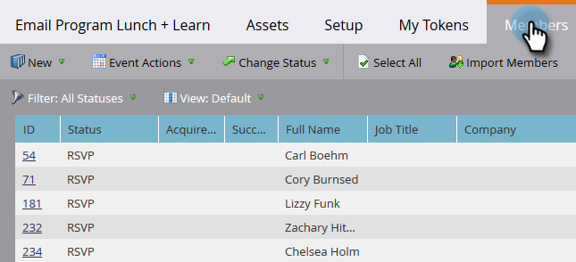
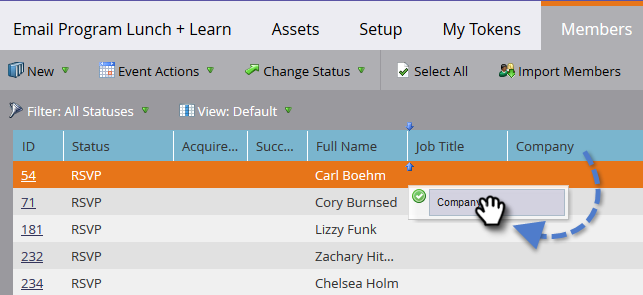

# Gestion et Vue des membres {#manage-and-view-members}

Vous pouvez gérer et vue vos membres dans vos programmes à l&#39;aide de l&#39;onglet Membres.

>[!NOTE]
>
>**FYI**
>
>Marketo est maintenant en train de normaliser la langue dans tous les abonnements. Vous pouvez donc voir des pistes dans votre abonnement et des personnes/personnes dans docs.marketo.com. Ces termes signifient la même chose ; cela n&#39;a aucune incidence sur les instructions relatives aux articles. Il y a aussi d&#39;autres changements. [En savoir plus](http://docs.marketo.com/display/DOCS/Updates+to+Marketo+Terminology).

>[!NOTE]
>
>**Plongée profonde**
>
> Explorez plus en détail l&#39;appartenance au programme.

## Rechercher un membre {#search-for-a-member}

Dans la partie inférieure de la section Membres, utilisez le champ de recherche pour rechercher des membres de programme par nom, adresse électronique, titre ou société.

1. Cliquez sur l&#39;onglet **Membres** de votre programme.

   

1. Utilisez le champ de recherche pour rechercher la liste des membres.

   

## Exportation de la grille de membres {#export-the-members-grid}

Vous pouvez exporter votre liste membre en cliquant sur l&#39;icône Excel en regard du champ de recherche.

## Gérer les colonnes dans la grille Membres {#manage-columns-in-the-members-grid}

* Faites glisser et déposez des colonnes pour modifier leur ordre. Les deux flèches bleues indiquent où va la colonne.

   

* Cliquez avec le bouton droit sur l’en-tête de colonne pour trier par ordre alphabétique, croissant ou décroissant.

   

## Choisir les colonnes visibles dans la grille {#choose-which-columns-are-visible-in-the-grid}

1. Cliquez sur la liste déroulante **Vue **et sélectionnez **Créer une Vue**.

   

1. Nommez votre vue personnalisée. Sélectionnez les titres des colonnes. Cliquez sur** Ajouter **et sur** Supprimer **pour déplacer des colonnes et créer une vue.

   

1. Cliquez sur **Créer**.

   

## Filtrage de la grille de membres  {#filter-the-members-grid}

1. Cliquez sur la liste déroulante **Filtre** et sélectionnez une étape de progression à trier.

   

## Gérer le statut de la personne dans la grille Membres {#manage-person-status-in-the-members-grid}

Vous pouvez modifier le statut de vos personnes dans la grille des membres.

1. Maintenez la touche **Ctrl/Cmd** enfoncée et sélectionnez les personnes.

   

1. Cliquez sur la liste déroulante **Modifier l’état** et sélectionnez un état.

   

   Cela peut prendre un moment. Vous verrez le message ci-dessous lorsque tout sera fait !

   

Beaucoup de caractéristiques, mais elles sont toutes assez simples. Bon appétit !

>[!MORELIKETHIS]
>
>* [Création d’un rapport de performances de Programme](../../../../product-docs/core-marketo-concepts/programs/program-performance-report/create-a-program-performance-report.md)

>

