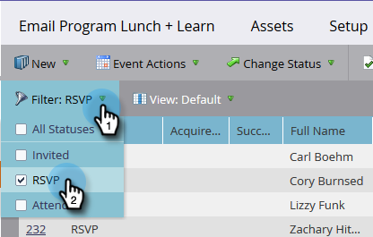
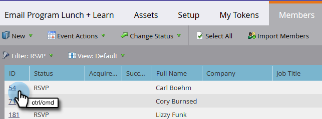

# Gestion et affichage des membres {#manage-and-view-members}

Vous pouvez gérer et afficher vos membres dans vos programmes à l’aide de l’onglet Membres .

>[!NOTE]
>
>Exploration plus approfondie [abonnement au programme](/help/marketo/product-docs/core-marketo-concepts/programs/creating-programs/understanding-program-membership.md).

## Recherche d’un membre {#search-for-a-member}

Au bas de la section Membres , utilisez le champ de recherche pour rechercher des membres du programme par nom, adresse électronique, titre de la tâche ou société.

1. Cliquez sur le bouton **Membres** de votre programme.

   

1. Utilisez le champ de recherche pour effectuer une recherche dans la liste des membres.

   

## Exportation de la grille des membres {#export-the-members-grid}

Vous pouvez exporter votre liste de membres en cliquant sur l’icône Excel en regard du champ de recherche.

## Gestion des colonnes dans la grille Membres {#manage-columns-in-the-members-grid}

Faites glisser et déposez des colonnes pour modifier leur ordre. Les deux flèches bleues indiquent où va aller la colonne.

Cliquez avec le bouton droit de la souris sur l’en-tête de colonne pour trier par ordre alphabétique, croissant ou décroissant.

## Sélectionner les colonnes visibles dans la grille {#choose-which-columns-are-visible-in-the-grid}

1. Cliquez sur le bouton **Affichage** et sélectionnez **Créer une vue**.

   

1. Nommez votre vue personnalisée. Sélectionnez les titres des colonnes. Cliquez sur **Ajouter** et **Supprimer** pour déplacer des colonnes et créer une vue.

   

1. Cliquez sur **Créer**.

   

## Filtrage de la grille Membres  {#filter-the-members-grid}

1. Cliquez sur le bouton **Filtrer** et sélectionnez une étape de progression à trier.

   

## Gestion de l’état de la personne dans la grille Membres {#manage-person-status-in-the-members-grid}

Vous pouvez modifier le statut de vos personnes dans la grille membres.

1. Maintenir enfoncée **Ctrl/Cmd** et sélectionnez les personnes.

   

1. Cliquez sur le bouton **Modifier l’état** et sélectionnez un état.

   

   Cela peut prendre un moment. Vous verrez le message ci-dessous lorsque tout sera terminé !

   

Tant de fonctions, mais elles sont toutes assez simples. Bon appétit !

>[!MORELIKETHIS]
>
>[Création d’un rapport Performance de programme](/help/marketo/product-docs/core-marketo-concepts/programs/program-performance-report/create-a-program-performance-report.md)
