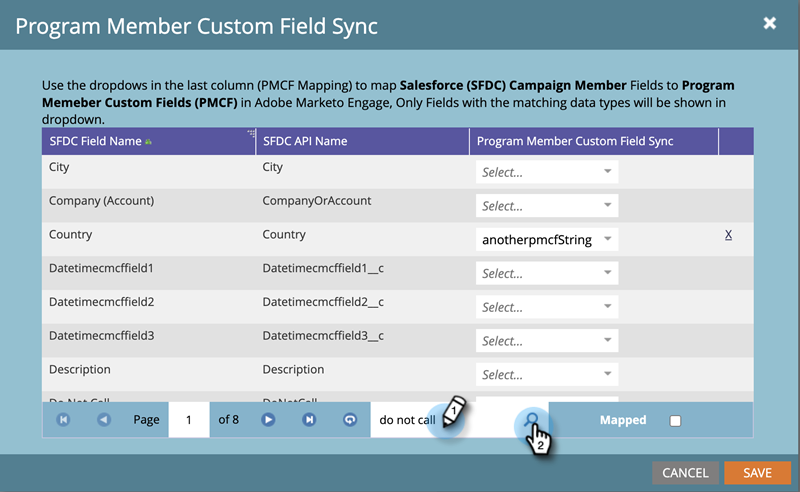

# Synchronisation des champs personnalisés des membres du programme {#program-member-custom-field-sync}

>[!PREREQUISITES]
>
>* Création de [Champs personnalisés des membres du programme](/help/marketo/product-docs/core-marketo-concepts/programs/working-with-programs/program-member-custom-fields.md){target="_blank"}
>* [Synchroniser une campagne Salesforce avec un programme](/help/marketo/product-docs/core-marketo-concepts/programs/working-with-programs/sync-an-sfdc-campaign-with-a-program.md){target="_blank"}

>[!NOTE]
>
>L’objet membre du programme peut comporter jusqu’à 20 champs personnalisés. Ces champs sont disponibles pour tous les programmes.

## Faire correspondre les champs Salesforce aux champs personnalisés des membres du programme {#map-salesforce-fields-to-program-member-custom-fields}

1. Dans Marketo, cliquez sur **[!UICONTROL Admin]**.

   

1. Cliquez sur **[!DNL Salesforce]**, puis sur **[!UICONTROL Modifier]** en regard de Synchronisation des champs personnalisés des membres du programme.

   

1. Utilisez la zone de recherche pour localiser les champs Salesforce à mapper. Dans cet exemple, nous utilisons Ne pas appeler.

   

1. Cliquez sur la liste déroulante.

   

1. Sélectionnez le champ personnalisé Membre du programme Marketo à mapper.

   

   >[!NOTE]
   >
   >La liste déroulante affiche uniquement les champs personnalisés des membres du programme correspondant au type de données du champ Salesforce.

1. Pour d’autres mappages de champ, désélectionnez la zone de recherche et répétez les étapes 3 à 5.

1. Cliquez sur **[!UICONTROL Enregistrer]** lorsque vous avez terminé.

   

   >[!IMPORTANT]
   >
   >Les modifications apportées aux données des membres du programme sur les champs mappés seront synchronisées dorénavant entre Marketo et Salesforce.

   >[!NOTE]
   >
   >Si vous renommez ou modifiez le type de données d’un champ dans Salesforce, nous supprimerons tout mappage de ce champ avec le champ personnalisé Membre du programme. Mais vous pouvez le remapper avec le nouveau champ après révision.

## Démapper les champs Salesforce des champs personnalisés des membres du programme {#unmap-salesforce-fields-from-program-member-custom-fields}

Si vous souhaitez libérer un champ afin de le remplacer, ou simplement apporter une modification générale, vous devez d’abord effectuer un démapping. Voici comment.

1. Dans Marketo, cliquez sur **[!UICONTROL Admin]**.

   

1. Cliquez sur **[!DNL Salesforce]**, puis sur **[!UICONTROL Modifier]** en regard de Synchronisation des champs personnalisés des membres du programme.

   

1. Utilisez la zone de recherche pour localiser le ou les champs que vous souhaitez annuler le mappage. Dans cet exemple, nous utilisons Ne pas appeler.

   

   >[!TIP]
   >
   >Vous pouvez cocher la case **[!UICONTROL Mapped]** pour afficher uniquement les champs mappés.

1. Annuler le mappage en cliquant sur le **X** en regard du champ.

   

1. Le mappage est maintenant supprimé. Cliquez sur **[!UICONTROL Enregistrer]**.

   

## Mappage des types de données {#data-type-mapping}

<table>
  <colgroup>
    <col/>
    <col/>
  </colgroup>
  <tbody>
    <tr>
      <th>Type de donnés SFDC</th>
      <th>Type de données de champ personnalisé du membre du programme</th>
    </tr>
    <tr>
      <td>Texte</td>
      <td>Chaîne</td>
    </tr>
    <tr>
      <td>Liste de sélection</td>
      <td>Chaîne</td>
    </tr>
    <tr>
      <td>Liste de sélection multiple</td>
      <td>Chaîne</td>
    </tr>
    <tr>
      <td>Téléphone</td>
      <td>Chaîne</td>
    </tr>
    <tr>
      <td>E-mail</td>
      <td>Chaîne</td>
    </tr>
    <tr>
      <td>Number(m)</td>
      <td>Entier</td>
    </tr>
    <tr>
      <td>Number(m,n)</td>
      <td>Flottante</td>
    </tr>
    <tr>
      <td>Case à cocher</td>
      <td>Booléenne</td>
    </tr>
    <tr>
      <td>URL</td>
      <td>URL</td>
    </tr>
    <tr>
      <td>Date</td>
      <td>Date</td>
    </tr>
    <tr>
      <td>Datetime</td>
      <td>Datetime</td>
    </tr>
    <tr>
      <td>Recherche (référence)</td>
      <td>Chaîne</td>
    </tr>
    <tr>
      <td>Base64</td>
      <td>Chaîne</td>
    </tr>
  </tbody>
</table>

>[!MORELIKETHIS]
>
>* [Modifier les données des membres du programme](/help/marketo/product-docs/core-marketo-concepts/smart-campaigns/program-flow-actions/change-program-member-data.md){target="_blank"}
>* [Afficher les données sur la grille Programme Member](/help/marketo/product-docs/core-marketo-concepts/programs/working-with-programs/manage-and-view-members.md){target="_blank"}
>* [Synchronisation SFDC - Synchronisation de campagne](/help/marketo/product-docs/crm-sync/salesforce-sync/sfdc-sync-details/sfdc-sync-campaign-sync.md){target="_blank"}
