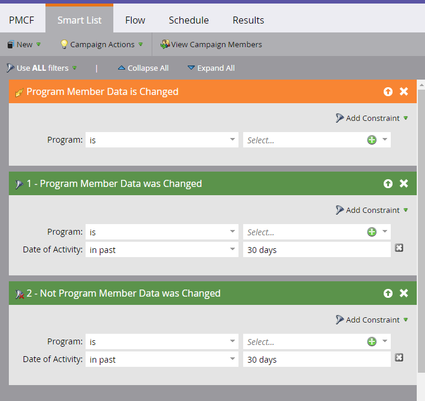

# Champs personnalisés de personne membre du programme {#program-member-custom-fields}

Les champs personnalisés Membre du programme vous permettent de collecter des données spécifiques au programme pour chaque membre. Ils peuvent être utilisés dans : formulaires Marketo, filtres et déclencheurs de liste dynamique et actions de flux de campagne dynamique. Les données sont visibles dans l&#39;onglet Membres du programme.

## Créer un champ personnalisé de membre de programme {#create-a-program-member-custom-field}

1. Dans Marketo, cliquez sur **[!UICONTROL Admin]**.

   

1. Cliquez sur **[!UICONTROL Gestion des champs]**.

   

1. Cliquez sur **[!UICONTROL Nouveau champ personnalisé]**.

   

1. Cliquez sur la liste déroulante **[!UICONTROL Objet]** et sélectionnez l’objet de votre choix.

   

   >[!NOTE]
   >
   >Les champs personnalisés [!UICONTROL Personne] et [!UICONTROL Membre du programme] ne peuvent pas partager le même nom.

1. Renseignez les champs restants et cliquez sur **[!UICONTROL Créer]**.

   

   >[!NOTE]
   >
   >Les types pris en charge pour les champs personnalisés [!UICONTROL Membre du programme] sont les suivants : booléen, date, datetime, flottant, entier, chaîne, URL. [En savoir plus sur les types de champs](/help/marketo/product-docs/administration/field-management/custom-field-type-glossary.md){target="_blank"}.

## Descriptions des objets {#object-descriptions}

| Objet | Description |
|---|---|
| Société | Nom de la société associée à la personne. |
| Opportunité | Une opportunité peut être associée à une personne ou à un compte en tant que vente future potentielle. Ils accèdent généralement à Marketo par le biais d’un CRM ou d’une API. |
| Personne | Un individu de votre base de données Marketo avec lequel vous interagissez par le biais de campagnes marketing. |
| Membre du programme | Personne qui est également membre d’un programme |

## Déclencheurs et filtres {#triggers-and-filters}

Vous pouvez exploiter ces données spécifiques au programme dans les listes dynamiques via [triggers](/help/marketo/product-docs/core-marketo-concepts/smart-campaigns/creating-a-smart-campaign/define-smart-list-for-smart-campaign-trigger.md){target="_blank"} et/ou [filtres](/help/marketo/product-docs/core-marketo-concepts/smart-lists-and-static-lists/creating-a-smart-list/find-and-add-filters-to-a-smart-list.md){target="_blank"}.

## Choses à savoir {#things-to-know}

* Les champs personnalisés du membre de programme sont disponibles dans les ressources locales uniquement. Ils ne sont pas pris en charge dans Design Studio, car il n’existe aucun moyen de les lier à un programme spécifique.
* Vous ne pouvez pas cloner/déplacer un formulaire (ou une page de destination avec un formulaire) contenant des champs personnalisés de membre de programme vers Design Studio.
* [Vous pouvez synchroniser](/help/marketo/product-docs/core-marketo-concepts/programs/working-with-programs/program-member-custom-field-sync.md){target="_blank"} les champs personnalisés des membres de programme avec les champs personnalisés des membres de campagne.
* L’objet Membre de programme peut avoir jusqu’à 20 champs personnalisés. Ces champs sont disponibles pour tous les programmes.
* Lorsque vous supprimez un membre d’un programme, s’il possède des données dans son champ personnalisé de membre de programme, les données sont effacées de ce champ.
* Pour afficher les données, cliquez sur l’onglet Membres dans le programme et créez une vue personnalisée qui inclut le ou les champs en question.
* L’importation et l’exportation via [list](/help/marketo/getting-started/quick-wins/import-a-list-of-people.md){target="_blank"} et [API](https://experienceleague.adobe.com/fr/docs/marketo-developer/marketo/home){target="_blank"} sont prises en charge. Les exportations fonctionnent uniquement sur les listes de membres de programme, et non sur les listes statiques.
* Lorsque vous fusionnez deux personnes, les données de champ personnalisé du membre de programme du gagnant sont utilisées. Mais si le gagnant n&#39;en a pas, la valeur du perdant sera utilisée.
* Le type de modification n’est pas autorisé dans les champs Informations sur le membre de programme.
* La contrainte de liste dynamique « contient » n’est pas prise en charge pour les champs personnalisés du membre de programme.

>[!MORELIKETHIS]
>
>* [Créer un champ personnalisé dans Marketo](/help/marketo/product-docs/administration/field-management/create-a-custom-field-in-marketo.md){target="_blank"}
>
>* [Synchronisation des champs personnalisés des membres du programme](/help/marketo/product-docs/core-marketo-concepts/programs/working-with-programs/program-member-custom-field-sync.md){target="_blank"}
