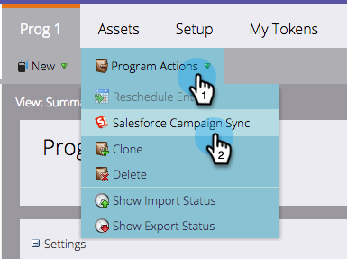

# Synchroniser un Campaign SFDC avec un Programme {#sync-an-sfdc-campaign-with-a-program}

Marketo vous permet de synchroniser vos programmes avec les campagnes Salesforce afin de conserver la même liste de personnes dans les deux systèmes, y compris leur état. Commençons !

>[!PREREQUISITES]
>
>Vous devez d&#39;abord [activer la synchronisation des campagnes Salesforce](/help/marketo/product-docs/crm-sync/salesforce-sync/setup/optional-steps/enable-disable-campaign-sync.md).

>[!CAUTION]
>
>Lors de la synchronisation d’une campagne SFDC avec un programme Marketo, les actions SFDC implicites (par exemple, ajouter à SFDC Campaign, synchroniser à SFDC) seront désactivées pour les campagnes enfants du programme.

1. Accédez à **Activités marketing**.

   

1. Sélectionnez votre programme.

   

1. Cliquez sur **Actions de Programme**, puis sélectionnez **Salesforce Campaign Sync**.

   

1. Sélectionnez **Créer** ou choisissez une campagne Salesforce existante.

   >[!TIP]
   >
   >Si vous sélectionnez une campagne Salesforce existante, veillez à [correspondre aux états de programme de la campagne Salesforce et du programme Marketo](/help/marketo/product-docs/crm-sync/salesforce-sync/sfdc-sync-details/sfdc-errors/how-to-match-program-statuses-and-salesforce-campaign-statuses-prior-to-sync.md).

1. Saisissez le nom de la nouvelle campagne et cliquez sur **Enregistrer**.

   

1. Vous pouvez maintenant vérifier les détails de synchronisation de la campagne dans la page de résumé du programme.

   

   Excellent ! Désormais, toute modification de l’état du programme dans Marketo est synchronisée avec la campagne de la DDC et vice versa.
