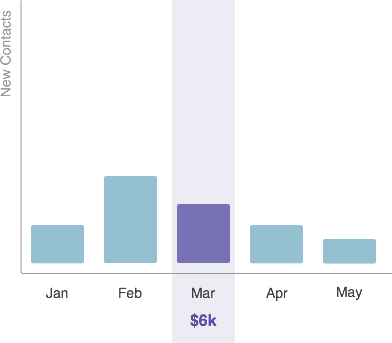

# Comprendre les coûts de la période {#understanding-period-costs}

## Aperçu {#overview}

Les coûts périodiques se rapportent à l&#39;argent que vous dépensez au cours d&#39;un mois donné sur un programme.

>[!NOTE]
>
>**Exemple**
>
>Si vous dépensez 1 000 $ pour embaucher un illustrateur pour un eBook qui démarre en juillet, le programme eBook coûterait 1 000 $ en juillet.
>
>Si vous dépensez 200 $ par mois dans Google Adwords, le programme Google Adwords aura un coût de 200 $ **par mois**.

>[!NOTE]
>
>[Présentation des Programmes](/help/marketo/product-docs/core-marketo-concepts/programs/creating-programs/understanding-programs.md)
>
>[Comprendre l&#39;appartenance à un Programme](/help/marketo/product-docs/core-marketo-concepts/programs/creating-programs/understanding-program-membership.md)

## Méthode de calcul des coûts de la période {#how-period-costs-are-calculated}

Imaginez un événement, comme un webinaire, qui se déroule en mars. De nouvelles personnes sont acquises à l&#39;avance grâce à la publicité en janvier et février. De nouveaux contacts sont également acquis après le événement, lorsque les gens téléchargent le webinaire dans les mois d&#39;avril et mai.

1. Avec un coût de période unique attribué à Mars...

   

   ...les contacts ajoutés dans les mois précédant et suivant seront *comptés uniquement* vers mars.

   

1. Avec des coûts de période attribués à janvier, février et mars...

   

   ...les contacts ajoutés seulement dans les mois qui suivent mars seront comptés pour mars.

   

1. Avec les coûts de la période attribués à janvier et avril...

   

   ...les contacts ajoutés dans les mois de janvier à mars compteront pour janvier. Les contacts ajoutés dans les mois d&#39;avril et mai seront comptés vers avril.

   

   >[!NOTE]
   >
   >En résumé - les mois sans période définie les coûts remontent &quot;en arrière&quot; à la dernière période définie. S&#39;il n&#39;y a pas de coût pour la période antérieure, les mois seront reportés à la période suivante définie. Si le coût d&#39;une période n&#39;a pas été défini pour _n_ mois, le rapports en RCE ne sera pas disponible pour le programme.

   >[!MORELIKETHIS]
   >
   >* [Utilisation des coûts de période dans un Programme](/help/marketo/product-docs/core-marketo-concepts/programs/working-with-programs/using-period-costs-in-a-program.md)
   >* [Filtrage d&#39;un rapport Programme par coût de période](/help/marketo/product-docs/core-marketo-concepts/programs/program-performance-report/filter-a-program-report-by-period-cost.md)

