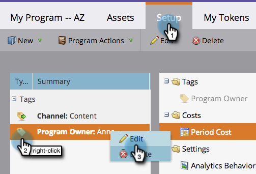

# Utilisation de balises dans un programme {#use-tags-in-a-program}

Les balises sont des attributs qui décrivent vos programmes et sont utilisés pour regrouper les types de programmes dans les rapports.

>[!NOTE]
>
>Si vous utilisez l&#39;Explorateur du cycle du chiffre d&#39;affaires, un coût de période doit être défini (même s&#39;il est égal à 0) pour que les rapports soient disponibles pour le programme.

## Utilisation d’une balise dans un programme {#use-a-tag-in-a-program}

1. Sélectionnez votre programme. Cliquez sur **[!UICONTROL Configurer]**.

   

1. Faites glisser et déposez une balise sur la zone de travail.

   

1. Sélectionnez une valeur dans la liste déroulante.

   

1. Cliquez sur **[!UICONTROL Enregistrer]**.

   

1. C&#39;est bon. La nouvelle balise s’affiche dans la zone de travail.

   

## Modifier une balise {#edit-a-tag}

1. Accédez à l’onglet **[!UICONTROL Configuration]**. Cliquez avec le bouton droit de la souris sur la balise . Sélectionnez **[!UICONTROL Modifier]**.

   

1. Cliquez sur la liste déroulante. Sélectionnez une nouvelle valeur.

   

1. Cliquez sur **[!UICONTROL Enregistrer]**.

   

1. Fantastique ! Les modifications doivent être répercutées dans la zone de travail.

   

## Supprimer une balise  {#delete-a-tag}

1. Accédez à l’onglet **[!UICONTROL Configuration]**. Cliquez avec le bouton droit sur la balise et sélectionnez **[!UICONTROL Supprimer]**.

   

1. Cliquez sur **[!UICONTROL Supprimer]** pour confirmer.

   

Beau travail ! Les programmes avec des balises cohérentes facilitent grandement les choses lorsque vous exécutez vos rapports.
