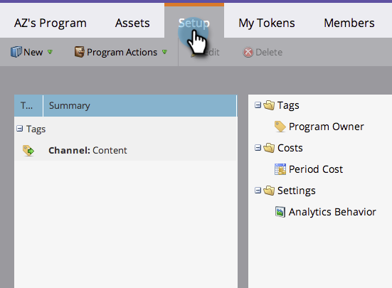
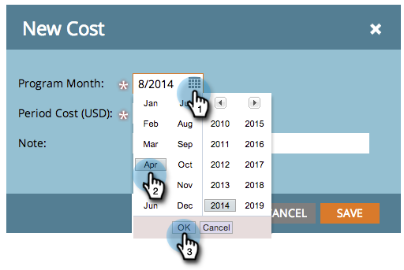
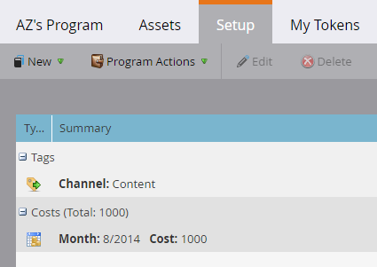
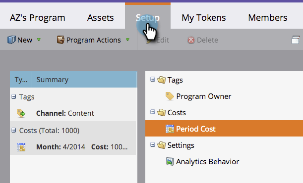
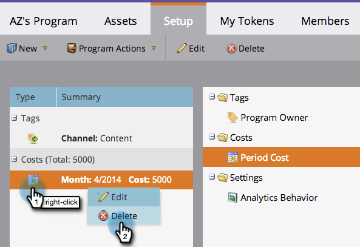
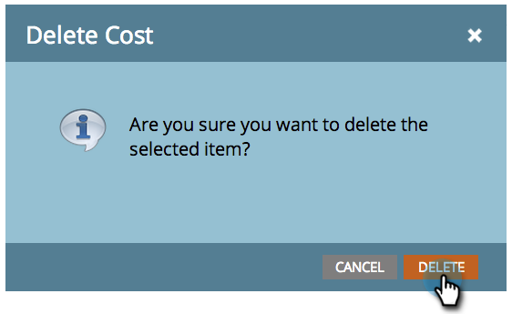

# Utiliser des coûts de la période dans un programme {#using-period-costs-in-a-program}

Un [coût de période](/help/marketo/product-docs/core-marketo-concepts/programs/working-with-programs/understanding-period-costs.md){target="_blank"} correspond au montant que vous dépensez pour un programme. Elle peut durer un ou plusieurs mois et est utilisée pour le reporting du retour sur investissement.

## Ajouter un coût périodique  {#add-a-period-cost}

1. Accédez à l’onglet **[!UICONTROL Configuration]** de votre programme.

   

1. Effectuez un glisser-déposer **[!UICONTROL Coût de la période]** dans la zone de travail.

   

1. Cliquez sur l’icône de calendrier. Sélectionnez un mois. Cliquez sur **[!UICONTROL OK]**.

   

1. Saisissez un **[!UICONTROL Coût de la période]** (sans décimales ni virgules). Cliquez sur **[!UICONTROL Enregistrer]**

   >[!NOTE]
   >
   >Il peut s’agir d’une estimation. Vous pouvez toujours modifier un coût de période une fois que vous connaissez le montant exact (voir la section suivante).

   

1. Le coût s’affiche dans le programme.

   

   >[!TIP]
   >
   >Vous pouvez faire glisser et déposer plusieurs coûts de période dans la zone de travail. Vous pouvez ainsi affecter plusieurs mois avec des coûts de période différents à votre programme.

## Modifier un coût périodique {#edit-a-period-cost}

1. Si vous dépensez plus ou moins d&#39;argent que prévu, vous pouvez modifier le coût de la période.

1. Accédez à l’onglet **[!UICONTROL Configuration]** de votre programme.

   

1. Cliquez avec le bouton droit de la souris sur **[!UICONTROL Coût de la période]**. Sélectionnez **[!UICONTROL Modifier]**.

   

1. Apportez vos modifications. Cliquez sur **[!UICONTROL Enregistrer]**

   

## Supprimer un coût périodique {#delete-a-period-cost}

1. Accédez à l’onglet **[!UICONTROL Configuration]** de votre programme.

   

1. Cliquez avec le bouton droit de la souris sur **[!UICONTROL Coût de la période]**. Sélectionnez **[!UICONTROL Supprimer]**.

   

1. Cliquez sur **[!UICONTROL Supprimer]** pour confirmer.

   

>[!MORELIKETHIS]
>
>* [Comprendre les coûts de la période](/help/marketo/product-docs/core-marketo-concepts/programs/working-with-programs/understanding-period-costs.md){target="_blank"}
>* [Filtrer un rapport de programme par coût de période](/help/marketo/product-docs/core-marketo-concepts/programs/program-performance-report/filter-a-program-report-by-period-cost.md){target="_blank"}
