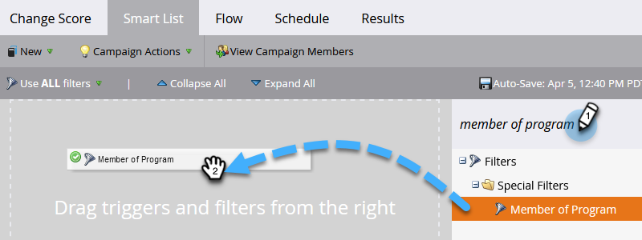
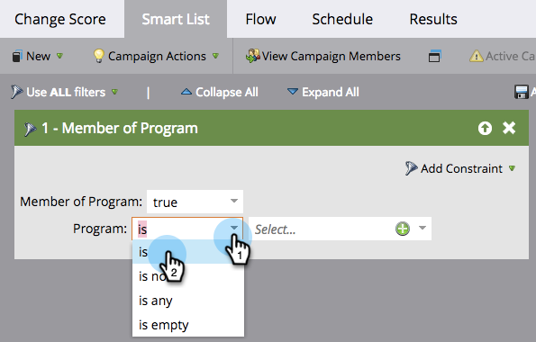

# Définition d’une liste dynamique pour Smart Campaign | Lot {#define-smart-list-for-smart-campaign-batch}

Les listes dynamiques sont le mécanisme qui permet, dans tout le Marketo Engage, de définir &quot;qui&quot; (quelles personnes) inclure, qu’il s’agisse d’un rapport, d’une liste ou d’une campagne dynamique. Voici comment définir une liste dynamique pour une campagne par lots.

>[!CAUTION]
>
>La modification d’une campagne active à l’étape Liste dynamique ou Flux peut potentiellement interrompre ses fonctionnalités. Si vous choisissez de le faire, faites preuve de prudence.

1. Choisissez une campagne dynamique, puis cliquez sur **[!UICONTROL Liste dynamique]**.

   

1. Saisissez pour rechercher un filtre, puis faites-le glisser sur la zone de travail. Répétez cette opération pour plusieurs filtres.

   

   >[!NOTE]
   >
   >Une campagne dynamique avec uniquement des filtres s’exécute dans _Lot_ mode . Il trouve dans la base de données les personnes qui remplissent les critères en fonction des filtres et les exécute toutes à la fois dans le flux.

   >[!NOTE]
   >
   >Vous pouvez lancer une campagne dynamique sur une personne à la fois en fonction des événements en direct en ajoutant des déclencheurs, ce qui place la campagne dynamique dans _Déclencheur_ mode .

1. Cliquez sur la liste déroulante et choisissez un opérateur de filtre pour le filtre que vous choisissez.

   

   >[!CAUTION]
   >
   >Des lignes rouges ondulent les erreurs ou les informations manquantes. Si elle n’est pas corrigée, la campagne est invalide et ne s’exécute pas.

1. Saisissez la valeur du filtre.

   

   >[!NOTE]
   >
   >Par défaut, les personnes qui respectent TOUTES les règles de liste dynamique sont qualifiées. Il peut être modifié en fonction de vos besoins de campagne. Consulter  [Règles de liste intelligente pour la logique complexe](/help/marketo/product-docs/core-marketo-concepts/smart-lists-and-static-lists/using-smart-lists/using-advanced-smart-list-rule-logic.md){target="_blank"} pour en savoir plus.

   Pour déclencher des événements en direct, une personne à la fois, apprenez à [Définition d’une liste dynamique pour Smart Campaign | Déclencheur](/help/marketo/product-docs/core-marketo-concepts/smart-campaigns/creating-a-smart-campaign/define-smart-list-for-smart-campaign-trigger.md){target="_blank"}.

   >[!MORELIKETHIS]
   >
   >* [Définition d’une liste dynamique pour Smart Campaign | Déclencheur](/help/marketo/product-docs/core-marketo-concepts/smart-campaigns/creating-a-smart-campaign/define-smart-list-for-smart-campaign-trigger.md){target="_blank"}
   >* [Ajout d’une étape de flux à une campagne dynamique](/help/marketo/product-docs/core-marketo-concepts/smart-campaigns/flow-actions/add-a-flow-step-to-a-smart-campaign.md){target="_blank"}
