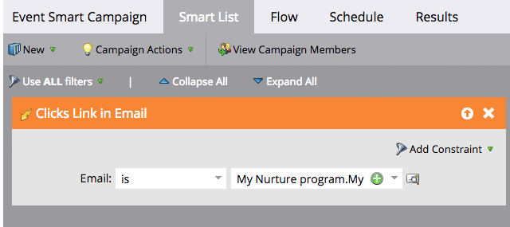
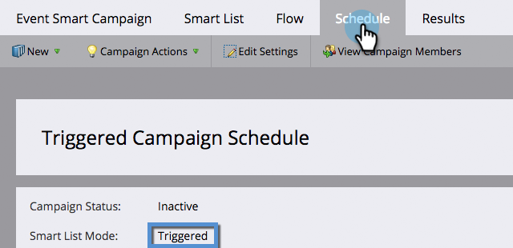

# Présentation des campagnes dynamiques par lots et par déclenchement {#understanding-batch-and-trigger-smart-campaigns}

Il existe deux types de campagnes intelligentes : Lot et Déclencheur.

## Campagne par lot {#batch-campaign}

>[!NOTE]
>
>**Définition**
>
>Une campagne par lots démarre à un moment spécifique et affecte un ensemble spécifique de personnes à la fois. Un exemple serait d&#39;envoyer un email à toutes les personnes en Californie.

Les campagnes par lots ne comportent que des filtres dans la section Liste dynamique (c’est-à-dire, aucun déclencheur).

Cliquez sur le bouton **[!UICONTROL Planification]** confirme que la campagne dynamique est définie sur &quot;Lot&quot;.

**Campagnes dynamiques par lots**

* Peuvent être planifiées pour des récurrences, telles que quotidiennes, hebdomadaires et mensuelles. Vous pouvez également les faire exécuter une seule fois.
* sont visibles dans la variable [vue planning du programme](/help/marketo/product-docs/core-marketo-concepts/programs/program-schedule-view/navigating-the-program-schedule-view.md){target="_blank"}. Tout ce qui suit une étape &quot;Attente&quot; dans la campagne dynamique ne sera pas inclus dans la vue.

  

## Campagne à déclencheurs {#trigger-campaign}

>[!NOTE]
>
>**Définition**
>
>Une campagne de déclenchement affecte une personne à la fois en fonction d’un événement déclenché. Un exemple de déclencheur consiste à cliquer sur un lien dans un email.

Si une campagne dynamique utilise au moins un déclencheur dans la section Liste dynamique , le mode est automatiquement défini sur déclenché.

Cliquez sur le bouton **[!UICONTROL Planification]** confirme que la campagne dynamique est définie sur &quot;Déclenchée&quot;.

**Campagnes déclenchées**

* Ne peut pas être planifié pour les récurrences. Ils ne peuvent être définis que sur actif ou inactif.
* Vous pouvez définir plusieurs déclencheurs. Toutefois, si un déclencheur est déclenché, les actions de campagne s’exécutent.

>[!TIP]
>
>Utilisez la variable [journal des activités](/help/marketo/product-docs/core-marketo-concepts/smart-lists-and-static-lists/managing-people-in-smart-lists/locate-the-activity-log-for-a-person.md){target="_blank"} pour savoir ce qui s’est passé pas à pas dans vos campagnes dynamiques. Le journal des activités se trouve dans le dernier onglet de la page des détails d’une personne.
