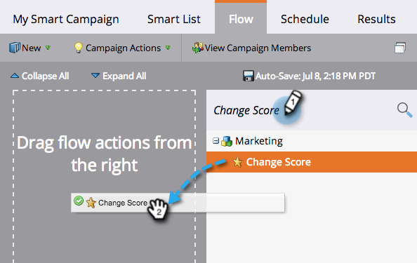

# Ajouter une étape de flux à un Campaign dynamique {#add-a-flow-step-to-a-smart-campaign}

Les étapes de flux indiquent à Marketing ce que vous souhaitez faire pour un groupe de personnes qui remplissent les conditions requises. Ce sont vos instructions, et la campagne intelligente fera votre affaire !

1. Accédez à **Activités marketing**.

   

1. Sélectionnez votre campagne intelligente et cliquez sur **Flux**.

   

   Tapez pour rechercher une étape de flux, puis faites-la glisser sur la trame. Vous pouvez ajouter plusieurs étapes de flux. Répétez cette étape à chaque étape que vous souhaitez que la campagne effectue.

   

1. Cliquez sur la liste déroulante et choisissez une option appropriée.

   

1. Saisissez la valeur.

   

>[!NOTE]
>
>Les étapes de flux sont exécutées dans l’ordre dans lequel elles sont répertoriées.  [Réorganisez les ](/help/marketo/product-docs/core-marketo-concepts/smart-campaigns/flow-actions/add-a-flow-step-to-a-smart-campaign/reorder-the-flow-steps-in-a-smart-campaign.md) étapes de flux pour vous assurer qu’elles se suivent bien.

>[!TIP]
>
>Une ligne rouge ondulée apparaît en cas d&#39;entrée non valide. Passez la souris sur la ligne pour voir comment la corriger.

Super ! Veillez à [examiner et valider la campagne intelligente](/help/marketo/product-docs/core-marketo-concepts/smart-campaigns/creating-a-smart-campaign/smart-campaign-checklist.md) avant de la planifier ou de l&#39;activer.

>[!MORELIKETHIS]
>
>* [Utiliser le choix des Ajoutes dans une étape de flux](/help/marketo/product-docs/core-marketo-concepts/smart-campaigns/flow-actions/use-add-choice-in-a-flow-step.md)
>* [Réorganisation des étapes de flux dans une Campaign dynamique](/help/marketo/product-docs/core-marketo-concepts/smart-campaigns/flow-actions/add-a-flow-step-to-a-smart-campaign/reorder-the-flow-steps-in-a-smart-campaign.md)

