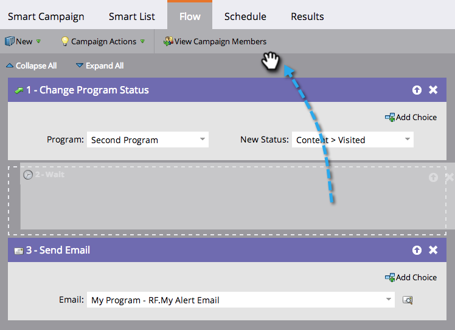

# Réorganisation des étapes de flux dans une Campaign dynamique {#reorder-the-flow-steps-in-a-smart-campaign}

Les étapes de flux s’exécutent de haut en bas. Voici comment réorganiser les étapes de flux en fonction de vos besoins.

>[!NOTE]
>
>**Conditions préalables**
>
>* [Ajouter une étape de flux à un Campaign dynamique](../../../../../product-docs/core-marketo-concepts/smart-campaigns/flow-actions/add-a-flow-step-to-a-smart-campaign.md)

>

1. Dans l’onglet Flux de campagne dynamique, faites glisser et déposez l’étape de flux vers l’emplacement souhaité.

>[!NOTE]
>
>**Rappel**
>
>Les étapes de flux s’exécutent dans l’ordre dans lequel elles apparaissent dans le flux.

Certaines choses sont plutôt simples. Faites glisser n&#39; drop away !