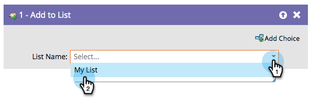

# Ajouter à la liste {#add-to-list}

Cette étape de flux permet d’ajouter des personnes aux listes.

Recherchez et sélectionnez la liste à laquelle vous souhaitez ajouter vos collaborateurs.

Plutôt simple !
