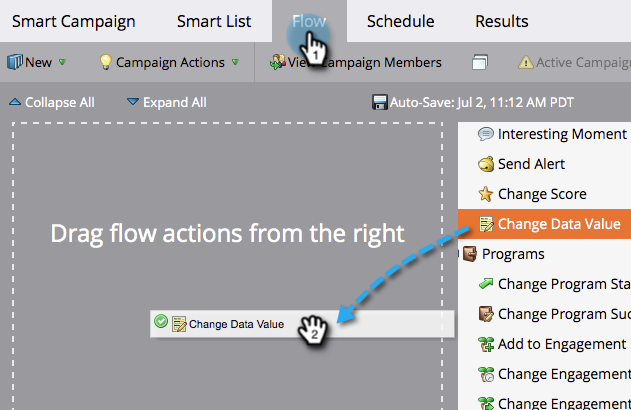
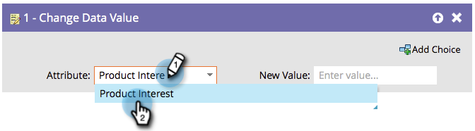

# Ajout de données à un champ {#append-data-to-a-field}

Il existe un moyen simple d’ajouter des données à un champ. Voici comment.

>[!PREREQUISITES]
>
>[Créer une campagne](/help/marketo/product-docs/core-marketo-concepts/smart-campaigns/creating-a-smart-campaign/create-a-new-smart-campaign.md){target="_blank"}

>[!NOTE]
>
>Les étapes ci-dessous s’appliquent également à [Modifier les données des membres du programme](/help/marketo/product-docs/core-marketo-concepts/smart-campaigns/program-flow-actions/change-program-member-data.md){target="_blank"}.

1. Sous l’onglet **[!UICONTROL Flux]**, faites glisser l’étape de flux **[!UICONTROL Modifier la valeur de données]**.

   

1. Recherchez et sélectionnez le champ auquel vous souhaitez ajouter des données.

   

1. Recherchez et sélectionnez le jeton correspondant au champ auquel vous souhaitez ajouter des données.

   

1. Ajoutez maintenant la valeur que vous souhaitez ajouter à ce qui existe déjà dans le champ.

   

C&#39;est tout ! Vous pouvez créer et y ajouter plusieurs jetons.
