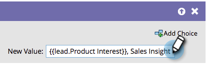

# Ajouter des données à un champ {#append-data-to-a-field}

Il existe un moyen facile d’ajouter des données à un champ. Voici comment faire.

>[!PREREQUISITES]
>
>[Créer une campagne](/help/marketo/product-docs/core-marketo-concepts/smart-campaigns/creating-a-smart-campaign/create-a-new-smart-campaign.md){target="_blank"}

>[!NOTE]
>
>Les étapes ci-dessous s’appliquent également à [Modifier les données de membre de programme](/help/marketo/product-docs/core-marketo-concepts/smart-campaigns/program-flow-actions/change-program-member-data.md){target="_blank"}.

1. Sous l’onglet **[!UICONTROL Flux]**, faites glisser l’étape de flux **[!UICONTROL Modifier la valeur des données]**.

   

1. Recherchez et sélectionnez le champ auquel vous souhaitez ajouter des données.

   

1. Recherchez et sélectionnez le jeton correspondant au champ auquel vous souhaitez ajouter des données.

   

1. Ajoutez maintenant la valeur que vous souhaitez ajouter à ce qui existe déjà dans le champ.

   

Vous avez terminé. Vous pouvez faire preuve de créativité et y ajouter plusieurs jetons.
