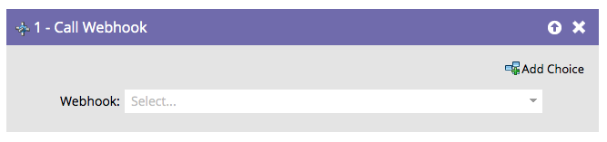

# Appeler le Webhook {#call-webhook}

>[!PREREQUISITES]
>
>[Créer un Webhook](/help/marketo/product-docs/administration/additional-integrations/create-a-webhook.md){target="_blank"}

Les Webhooks vous permettent d’interagir avec des services tiers. Envoyez/recevez des informations en appelant un webhook dans un flux de campagne intelligent.

>[!NOTE]
>
>Découvrez les nombreuses choses fascinantes que [Webhooks](https://experienceleague.adobe.com/en/docs/marketo-developer/marketo/webhooks/webhooks){target="_blank"} peut faire pour vous.

1. Sélectionnez un Webhook dans la liste déroulante.

Votre webhook sera désormais appelé chaque fois que des personnes entrent dans le flux de campagne intelligente.

>[!MORELIKETHIS]
>
>[Utilisation d’un Webhook dans une campagne dynamique](/help/marketo/product-docs/core-marketo-concepts/smart-campaigns/flow-actions/use-a-webhook-in-a-smart-campaign.md){target="_blank"}
