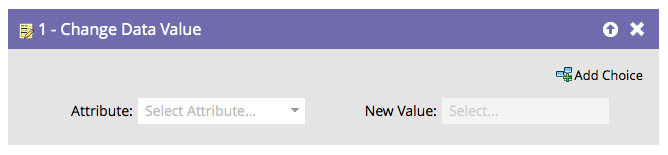
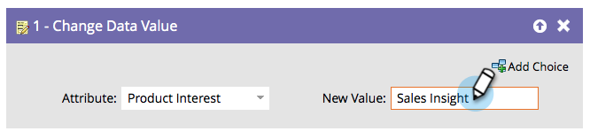

# Modifier la valeur des données {#change-data-value}

## Vue d’ensemble {#overview}

Vous pouvez utiliser Marketo pour mettre à jour la valeur d’un champ. Pour ce faire, vous utiliserez l’action de flux **[!UICONTROL Modifier la valeur de données]**.

>[!NOTE]
>
>Vous pouvez également empêcher la mise à jour d’un champ. Pour plus d’informations, voir [Bloquer les mises à jour d’un champ](/help/marketo/product-docs/administration/field-management/block-updates-to-a-field.md){target="_blank"} .

## Utilisation {#usage}

1. Recherchez et sélectionnez le champ dont vous souhaitez modifier la valeur.

   

1. Saisissez la valeur souhaitée, et vous avez terminé !

   

   >[!NOTE]
   >
   >Vous pouvez également utiliser des jetons dans **[!UICONTROL Nouvelle valeur]**.

   >[!TIP]
   >
   >Vous pouvez saisir &quot;NULL&quot; (sans guillemets, toutes majuscules) dans **[!UICONTROL Nouvelle valeur]** pour effacer le champ. Pour plus d’informations, voir [Effacer les valeurs de champ](/help/marketo/product-docs/core-marketo-concepts/smart-campaigns/flow-actions/clear-field-values.md){target="_blank"} .

   >[!NOTE]
   >
   >* [Jetons pour les étapes de flux](/help/marketo/product-docs/core-marketo-concepts/smart-campaigns/flow-actions/use-tokens-in-flow-steps.md){target="_blank"}
   >* [Ajouter des données à un champ](/help/marketo/product-docs/core-marketo-concepts/smart-campaigns/flow-actions/append-data-to-a-field.md){target="_blank"}
