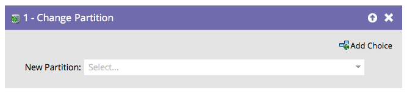

# Modifier la partition de personne {#change-person-partition}

## Aperçu {#overview}

Si vous utilisez [des espaces de travail et des partitions](/help/marketo/product-docs/administration/workspaces-and-person-partitions/understanding-workspaces-and-person-partitions.md), vous souhaiterez créer des campagnes intelligentes pour déplacer les personnes d&#39;une partition à une autre.

## Utilisation {#usage}

1. Sélectionnez la partition dans laquelle vous souhaitez déplacer les utilisateurs.

C&#39;est si facile !
