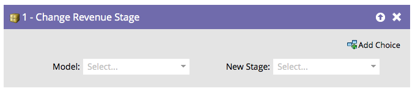

# Modifier l&#39;étape dans le cycle de vente {#change-revenue-stage}

Si vous utilisez Revenue Cycle Modeler et disposez d’un modèle approuvé, vous pouvez décider de déplacer les personnes manuellement d’une étape à l’autre. Cette étape de flux vous aidera.

1. Sélectionnez le **[!UICONTROL Modèle]**.

   

1. Sélectionnez la **[!UICONTROL Nouvelle étape]** que vous souhaitez attribuer et vous avez terminé !

   

   >[!CAUTION]
   >
   >L’entrepôt de données prête une attention particulière au moment où les utilisateurs passent d’une étape à l’autre. Cela peut créer des données incorrectes si elles sont utilisées de manière incorrecte.
