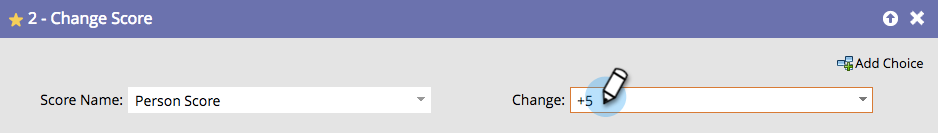

# Modifier évaluation {#change-score}

Il est facile et puissant de noter des personnes et aide votre équipe de vente à établir des priorités.

1. Choisissez le champ de score à modifier.

   

   >[!TIP]
   >
   >Vous pouvez créer plusieurs champs de score. Voir [Création d’un champ personnalisé dans Marketo](/help/marketo/product-docs/administration/field-management/create-a-custom-field-in-marketo.md){target="_blank"} pour plus d’informations.

1. Saisissez la modification de score souhaitée.

   

   Modifications :

   * **+5** incrémenter
   * **-5** décrémentera (nombres négatifs autorisés)
   * **=5** attribuera au score le nombre exact
   * **=-5** rendra le score ce nombre exact négatif

Obtenez rapidement des scores de base, puis ajustez les résultats au fil du temps.
