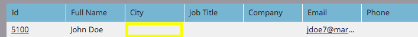

# Effacer les valeurs de champ {#clear-field-values}

[Modifier la valeur de données](/help/marketo/product-docs/core-marketo-concepts/smart-campaigns/flow-actions/change-data-value.md) est une bonne chose, mais comment _supprimer_ complètement la valeur ? Bonne question !

1. À l’étape du flux, choisissez le champ à effacer et saisissez **NULL** (toutes les majuscules) comme **Nouvelle valeur**.

   

1. Boum ! Je parie que tu ne savais pas ça ! Une fois l’étape de flux terminée, la valeur du champ que vous choisissez est effacée.

   

   >[!CAUTION]
   >
   >Si vous laissez la nouvelle valeur vide ou entrez simplement un espace, le champ ne sera pas réellement vide. Vous devez saisir NULL. En outre, n’oubliez pas que les étapes de flux ne peuvent pas être annulées après exécution.
