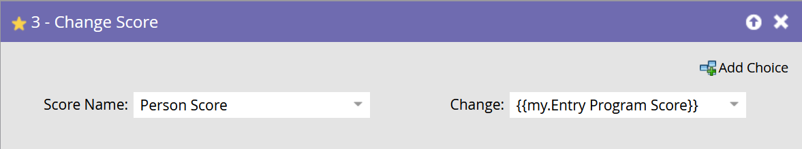

# Lancer la campagne {#execute-campaign}

Une campagne exécutable, comme les autres campagnes, contient une liste dynamique, un flux et un planning. Contrairement aux autres campagnes, vous ne pouvez pas réellement la planifier ni l’activer. Elle ne peut être appelée que par une autre campagne via l’étape de flux Exécuter la campagne . Les étapes de flux dans la campagne exécutable sont exécutées en série avec la campagne parent (contrairement à la campagne de demande, qui s’exécute en parallèle dans une campagne de déclenchement distincte).

>[!NOTE]
>
>Les campagnes exécutables sont toujours des enfants de la campagne (parente) qui les appelle.

## Quand utiliser Exécuter la campagne {#when-to-use-execute-campaign}

Vous pouvez réaliser de nombreuses opérations à l’aide d’une campagne exécutable. Ils sont conçus pour faciliter les tâches opérationnelles courantes, telles que le routage des prospects, la gestion du cycle de vie et la notation (entre autres), et peuvent être utilisés pour exécuter le même workflow à partir de campagnes par lots ou déclenchées.

Vous pouvez également les utiliser lorsque vous devez exécuter un flux distinct, mais vous devez dépendre des résultats de ce flux dans les choix d’étape de flux suivants (c’est-à-dire, si tel est le cas, faites-le).

L’option Exécuter la campagne constitue une amélioration par rapport à [Demander la campagne](/help/marketo/product-docs/core-marketo-concepts/smart-campaigns/flow-actions/request-campaign.md), dans la mesure où elle peut être exécutée en série, tandis que cette dernière ne s’exécute qu’en parallèle.

>[!NOTE]
>
>Les étapes d’attente et les Webhooks ne seront jamais compatibles avec les campagnes exécutables. Pour cela, vous devez utiliser Demander la campagne à la place.

## Création d’une campagne exécutable {#how-to-create-an-executable-campaign}

1. Cliquez avec le bouton droit de la souris sur le programme souhaité, puis sélectionnez **[!UICONTROL Nouvelle campagne intelligente]**.

   

1. Attribuez-lui un nom, cochez la case **[!UICONTROL Exécutable]**, puis cliquez sur **[!UICONTROL Créer]**.

   

1. Définissez la liste dynamique et le flux, comme pour toute autre campagne dynamique.

Vous pouvez également cloner une campagne dynamique existante. Si vous clonez une campagne exécutable existante, vous devrez toujours cocher la case **[!UICONTROL Exécutable]** après l’avoir nommée.

>[!NOTE]
>
>Vous ne pouvez pas cloner une campagne qui contient des déclencheurs.

## Utiliser le contexte de jeton de la campagne parente {#use-parent-campaign-token-context}

Lorsque la valeur est définie sur true, les contextes de jeton suivants seront envoyés à la campagne enfant (celle en cours d’exécution) :

* Mes jetons
* Jetons de campagne
* Jetons de programme
* Jetons de membre
* [Jetons de déclenchement](/help/marketo/product-docs/marketo-sales-insight/msi-for-salesforce/features/tabs-in-the-msi-panel/interesting-moments/trigger-tokens-for-interesting-moments.md) (s’ils sont appelés à partir d’une campagne déclenchée)

**Interaction API**

Lors de l’utilisation de la planification ou de la requête de campagne [dans l’API](https://experienceleague.adobe.com/en/docs/marketo-developer/marketo/rest/assets/smart-campaigns#batch), tous deux vous permettent de transmettre des valeurs pour Mes jetons, ce qui remplace les valeurs définies pour ces jetons dans la campagne que vous appelez. Si cette campagne exécute ensuite une autre campagne et définit « Utiliser le contexte parent sur Vrai », elle utilisera les valeurs transmises par l’intermédiaire de l’API, plutôt que les valeurs définies dans l’application.

## Éléments à noter {#things-to-note}

* La liste dynamique exclura toute personne qui ne remplit pas les critères. Si une personne se qualifie, l’enregistrement d’activité Campagne exécutée qui en résulte la répertorie comme « Qualifié : VRAI » (et FAUX dans le cas contraire)
* Les règles de qualification Planifier la campagne s’appliquent (paramètres de campagne intelligente sous l’onglet Planifier )
* Les campagnes exécutables ne peuvent pas être appelées dans les espaces de travail
* Si vous utilisez l’action de flux [Supprimer du flux](/help/marketo/product-docs/core-marketo-concepts/smart-campaigns/flow-actions/remove-from-flow.md) ciblant une campagne exécutable, elle ciblera à la fois l’enfant et le parent
* Utilisation de l’héritage des jetons : par exemple, si un seul flux de notation commun est déclenché par plusieurs ressources différentes, vous pouvez définir un score My Token par défaut dans la campagne enfant et dans la campagne parent afin de pouvoir remplacer la valeur de campagne de score enfant pour vos campagnes parents (voir ci-dessous pour obtenir un exemple visuel)
* Les campagnes exécutables peuvent être appelées jusqu&#39;à trois niveaux de profondeur (par exemple, Campagne parent > Enfant > Enfant > Enfant)

>[!CAUTION]
>
>Ne laissez jamais vos listes intelligentes pour les campagnes exécutables invalides, sinon _personne_ ne sera éligible. Une bonne pratique consiste à créer des ressources de liste dynamique distinctes, à les définir complètement et à s’assurer qu’elles sont valides. Ensuite, utilisez le filtre « Membre de la liste dynamique » dans la campagne exécutable afin de pouvoir échanger votre définition de liste dynamique.

## Exemple d’héritage de jeton {#token-inheritance-example}

Vous trouverez ci-dessous un exemple visuel d’héritage de jeton dans une campagne exécutable et deux campagnes parents : l’une avec un contexte de jeton défini sur **[!UICONTROL True]**, l’autre sur **[!UICONTROL False]**.

Campagne enfant avec score de modification segmenté en unités lexicales.

La campagne enfant s&#39;appelle Mes jetons.

### Exemple 1 - Vrai {#example-one-true}

Dans l’étape de flux Exécuter la campagne de la première campagne parent, la variable « [!UICONTROL  Utiliser le contexte du jeton de campagne parent ] » est définie sur **[!UICONTROL True]**.

La campagne parent est Mes jetons.

Les résultats : score modifié de +10.

### Exemple 2 : False {#example-two-false}

Dans l’étape de flux Exécuter la campagne de la deuxième campagne parente, la variable « Utiliser le contexte du jeton de campagne parent » est définie sur **False**.

La campagne parent est Mes jetons.

Résultats : score inchangé, car la valeur de score de la campagne enfant, +0, a été utilisée.

