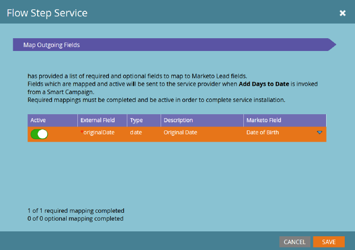
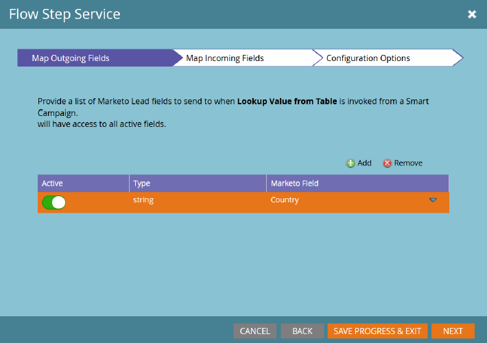

# Étape de déroulement du service {#flow-step-service}

Les étapes de flux en libre-service constituent une structure et un ensemble de fonctionnalités permettant de créer, de publier et d’intégrer des services web dans des campagnes dynamiques Adobe Marketo Engage. Ce guide est destiné aux utilisateurs finaux Marketo Engage qui souhaitent installer et utiliser des services qui ont déjà été créés et publiés. Pour plus d’informations sur la création et la publication de votre propre service, reportez-vous au [référentiel GitHub pour l’interface du fournisseur de services](https://github.com/adobe/Marketo-SSFS-Service-Provider-Interface){target="_blank"}. Une implémentation de table de recherche de preuve de concept se trouve [ici](https://github.com/adobe/mkto-flow-lookup){target="_blank"}.

## Intégration et gestion des services {#onboarding-and-managing-services}

L’installation d’une étape de flux personnalisé nécessite des autorisations d’administrateur dans Marketo. Outre l’URL d’installation, tous les autres aspects d’un service peuvent être modifiés après l’intégration initiale en parcourant l’écran des détails du service dans la grille Fournisseurs de service .

## URL d’installation {#installation-url}

Pour commencer l’installation, vous devez d’abord obtenir l’URL du document OpenAPI qui définit votre service. Votre fournisseur de services doit être en mesure de vous le fournir et aura généralement une URL se terminant par `/openapi.json`. Les URL complètes ressembleront à `https://www.example.com/OpenAPI.json`. Une fois que vous disposez de cette URL, accédez au menu Fournisseurs de services de votre section d’administration.

Cliquez sur **[!UICONTROL Suivant]** pour accéder à la section Entrer les informations d’identification du service .

## Entrer les informations d’identification du service {#enter-service-credentials}

Pour accéder au service en cours d’installation, Marketo doit disposer d’informations d’identification d’API valides. Ces informations d’identification doivent vous être fournies par votre fournisseur de services. Les services disposent de trois options d’authentification différentes. Vous pouvez donc voir l’une des trois invites d’identification : **Clé API** qui ne comporte qu’un seul champ d’entrée, **Authentification de base** qui nécessite un nom d’utilisateur et un mot de passe, ainsi qu’un champ appelé Realm, et **OAuth2** à l’aide de l’octroi _Informations d’identification client_ qui nécessite un _ID client ID} et un_} ID  _Client Secret_.

Lorsque vous enregistrez vos informations d’identification, Marketo tente d’appeler le point de terminaison d’état du service pour vérifier qu’elles sont valides. Si les informations d’identification fournies sont incorrectes, une erreur s’affiche pour vous l’indiquer.

>[!CAUTION]
>
>Si un fournisseur de services est créé et supprimé, vous ne pourrez plus réutiliser son nom de fournisseur de services, d’API, de déclencheur ou de filtre.

## Guide d’intégration (facultatif) {#onboarding-guide}

Certains fournisseurs de services incluent une étape facultative du guide d’intégration. Cette étape comprend toutes les instructions supplémentaires pour terminer l’intégration du service qui sont spécifiques à ce service.

## Appariement des champs {#field-mapping}

Pour recevoir ou renvoyer des données d’un champ de piste spécifique, ce champ doit être mappé. Bien que le mappage soit une étape requise lors de l’intégration, vous pouvez toujours revenir à la modification ultérieure des mappages. Il existe deux types de mappages configurés dans des écrans distincts : **Champs sortants**, qui sont envoyés au service lorsque Marketo appelle l’étape de flux, et **Champs entrants** qui sont des champs pouvant recevoir des données du service lorsqu’il renvoie des données à Marketo.

>[!NOTE]
>
>En mappant un champ sortant, vous autorisez Marketo à transmettre des données de ce champ liées à des pistes qui sont traitées par le service associé. Assurez-vous que vous disposez des autorisations et des compétences juridiques appropriées pour transmettre ces données à votre fournisseur de services, car ces champs peuvent inclure des informations d’identification personnelle couvertes par les lois sur la confidentialité, la protection et la connexion des données.

Les mappages de champs facultatifs peuvent être désactivés sans interruption de votre service, mais les mappages requis peuvent ne pas être supprimés ou complètement désactivés.

## Mappages pilotés par le service {#service-driven-mappings}

Les services qui comportent un ensemble fixe d’entrées et de sorties, comme une étape de flux d’enregistrement d’événement, utilisent des **mappages pilotés par le service**. Pour ce type de mappage, le fournisseur de services fournira un type de données et un indice sous la forme d’un nom d’API. Si l’indice correspond au nom de l’API d’un champ de piste existant, ce champ est automatiquement renseigné dans la section de mappage. Pour les champs sans indice correspondant, vous devez renseigner manuellement le mappage à partir de la liste des champs avec le type de données correspondant. Les mappages requis doivent être renseignés pour terminer l’intégration.

## Mappages pilotés par l’utilisateur {#user-driven-mappings}

Les services qui n’ont pas de jeu fixe d’entrées et de sorties, comme un service de mise en forme de date, utilisent des **mappages pilotés par l’utilisateur**. Cela signifie que chaque champ entrant et sortant doit être configuré par un administrateur.

## Champs sortants {#outgoing-fields}

Les champs sortants sont ceux qui sont envoyés au service d’étape de flux lorsque cette étape de flux est utilisée dans une campagne dynamique.

## Champs entrants {#incoming-fields}

Les champs entrants sont ceux vers lesquels le service d’étape de flux est autorisé à écrire des données.

## Options de configuration (facultatif) {#configuration-options}

Certains services disposent d’options de configuration globales facultatives ou obligatoires. Si des options sont requises, une valeur doit être définie pour toutes les options requises avant d’enregistrer ou de terminer l’intégration. Les paramètres dont les noms sont en italique sont envoyés au service appelé en tant qu’en-têtes.

## Retrait d’un service {#retiring-a-service}

Pour faciliter la transition vers des versions nouvelles ou alternatives d’un service, sans interrompre l’utilisation active, les services peuvent être retirés du menu Fournisseurs de services . **Le retrait d’un service** supprime l’étape de flux correspondante de la palette Flux de campagne dynamique, de sorte qu’aucune nouvelle utilisation ne puisse être créée. Dans la plupart des cas, un service de remplacement doit être prêt à remplacer le service existant lorsque vous choisissez de retirer un service.

## Abandon de service {#service-deprecation}

Parfois, les fournisseurs de services devront abandonner les services d’étape de flux comme partie normale du cycle de vie du logiciel. Lorsqu’un prestataire l’annonce, la Date d’obsolescence et le Message sont renseignés dans la vue de grille Fournisseurs de services . Si vous continuez à utiliser un service obsolète, cela peut entraîner une interruption de service s’il ne répond plus de la manière attendue ou si vous arrêtez d’accepter les demandes provenant des campagnes dynamiques Marketo. Vous devez donc prêter attention aux notifications d’obsolescence de service que vous recevez et prendre les mesures appropriées pour annuler ou remplacer les étapes du service qui sont toujours en cours d’utilisation.

## Utilisation d’étapes de flux tierces et personnalisées {#using-third-party-and-custom-flow-steps}

Les étapes de flux installées peuvent être utilisées de la même manière que les étapes de flux standard. Tous les paramètres de flux définis par le service sont présentés aux utilisateurs finaux.

## Actualisation des listes de sélection {#refreshing-picklists}

Marketo actualise tous les soirs les choix de liste de sélection des services, mais il arrive que vous ayez besoin de nouveaux choix disponibles, tels que la création de campagnes. Vous pouvez les actualiser facilement à partir de n’importe quelle instance de l’étape de flux à l’aide du bouton d’actualisation, ou en accédant au menu Admin > Fournisseurs de services et en cliquant sur Actualiser la liste de sélection une fois votre service sélectionné.

## Vérification des champs entrants {#checking-incoming-fields}

Vous pouvez vérifier les champs entrants configurés pour une étape de flux donnée en pointant sur l’icône d’info-bulle correspondante. Cela s’avère utile pour déterminer les champs qui peuvent changer lorsqu’une piste traverse la piste. Vous pouvez donc configurer des choix lors des étapes suivantes à l’aide de ces champs.

## Champs entrants et modifications des valeurs de données {#incoming-fields-and-data-value-changes}

Contrairement à la plupart des autres étapes de flux, celles implémentées avec la structure SSFS peuvent réécrire des données dans les champs de piste qui sont mappés par un administrateur et enregistrer ces modifications en tant qu’activités Modification de la valeur des données .  Lorsqu’une étape de flux écrit des données de cette manière, toutes ces modifications sont effectuées avant que la campagne dynamique ne passe aux étapes suivantes, de sorte que toutes les données écrites puissent être utilisées lors des choix d’étapes de flux suivants.

## Journaux et statistiques du service {#service-logs-and-statistics}

Chaque service d’étape de flux est associé à plusieurs types de journalisation afin de surveiller l’intégrité et de résoudre les problèmes liés à l’intégration.

## Service Statistics {#service-statistics}

Le journal des statistiques de service regroupe les résultats des appels et des rappels pour chaque service. Ils sont regroupés par heure, niveau (bloc ou enregistrement) et code, et fournissent les décomptes et le message de journal le plus récent pour chaque code reçu. Ce tableau de bord est principalement conçu pour faciliter la surveillance de l’intégrité des services.
