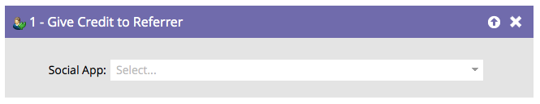

# Créditer le référent {#give-credit-to-referrer}

Lors de l’exécution d’une [offre de référence](/help/marketo/product-docs/demand-generation/social/referral-offers/create-a-referral-offer.md){target="_blank"} ou d’un [tirage](/help/marketo/product-docs/demand-generation/social/sweepstakes/create-sweepstakes.md){target="_blank"}, vous pouvez accorder du crédit au référent à l’aide de différentes méthodes :

* Visites sur recommandation
* Inscription sur parrainage
* **Déclencheur de liste dynamique**
* Événement personnalisé JavaScript

Si vous avez choisi d’utiliser l’option **Déclencheur de liste dynamique** pour spécifier un objectif, vous devrez utiliser l’étape de flux **Attribuer du crédit au référent** .

1. Une fois que vous avez créé votre campagne et décidé de l’action à déclencher, recherchez et sélectionnez simplement l’application Social à laquelle vous souhaitez attribuer le crédit au référent.

   

   >[!NOTE]
   >
   >Assurez-vous que votre application sociale est configurée pour utiliser le déclencheur de liste dynamique. Pour plus d’informations, voir [Définition de l’objectif pour l’offre de parrainage](/help/marketo/product-docs/demand-generation/social/referral-offers/specify-goal-for-referral-offer.md){target="_blank"} .

Excellent ! Toute personne traitée par cette étape de flux crédite désormais son référent.
