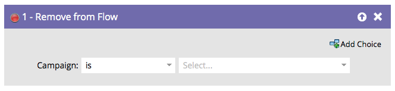

# Supprimer des flux {#remove-from-flow}

Imaginez que vous ayez un flux de campagne intelligente qui utilise « Envoyer une alerte » pour rappeler à un commercial d’appeler un prospect actif. Il envoie un message tous les jours jusqu’à ce que le représentant passe l’appel. Vous pouvez utiliser l’option « Supprimer du flux » dans une campagne de déclenchement une fois que le prospect a été contacté pour arrêter d’autres alertes. C&#39;est comme un siège éjecteur Smart Campaign pour une personne.

>[!NOTE]
>
>Cela affecte normalement les personnes qui se trouvent à l’étape d’attente d’un flux de campagne.

1. Recherchez et sélectionnez la campagne intelligente dont vous souhaitez supprimer des personnes.

   

>[!NOTE]
>
>Vous pouvez choisir une campagne intelligente spécifique ou choisir « cette campagne » dans le menu déroulant **[!UICONTROL Campagne]** pour sélectionner la campagne dans laquelle vous vous trouvez physiquement au moment de l’opération.

>[!NOTE]
>
>Cette fonctionnalité est destinée à être utilisée dans les étapes de flux d’une campagne dynamique.
