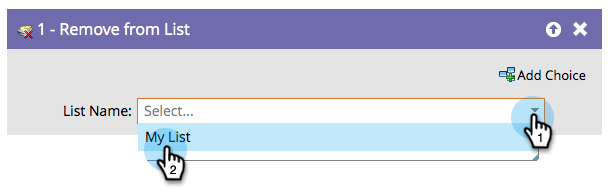

# Supprimer de la Liste {#remove-from-list}

## Aperçu {#overview}

Puisque vous pouvez ** [Ajouter à la Liste](add-to-list.md)**, vous avez également besoin d&#39;un moyen de retirer des personnes des listes.

## Utilisation {#usage}

1. Recherchez et sélectionnez la **Liste** dont vous souhaitez supprimer les personnes.

   

   C&#39;est tout ! Facile comme de la tarte.

