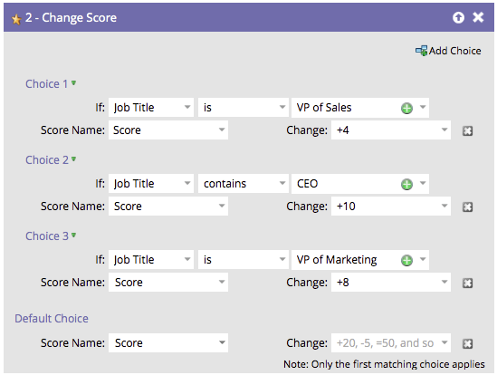

# Réorganiser l’ajout d’un choix dans une étape de flux {#reorder-add-choice-in-a-flow-step}

Puisque seul le premier choix correspondant s’applique à une personne, l’ordre a son importance. Si vous souhaitez modifier l’ordre des conditions définies dans une étape de flux, procédez comme suit.

1. Recherchez l’étape de flux pour laquelle vous souhaitez modifier l’ordre d’un choix.

   

1. Dans cet exemple, déplaçons le choix 3 au-dessus du choix 2. Cliquez sur **[!UICONTROL Choix 3]** puis sur **[!UICONTROL Déplacer vers le haut]**.

   

   >[!NOTE]
   >
   >Lors de la réorganisation, vous pouvez **[!UICONTROL Déplacer vers le haut]**, **[!UICONTROL Déplacer vers le bas]** ou **[!UICONTROL Déplacer vers]**.

   Vous pouvez déplacer un choix vers le haut ou vers le bas par incréments uniques.

   

**ÉTAPE FACULTATIVE** : Si vous avez plusieurs choix et que vous devez déplacer un ou plusieurs niveaux vers le haut ou vers le bas, vous pouvez utiliser cette autre méthode pour gagner du temps. Cliquez sur le choix à déplacer, puis sous **[!UICONTROL Déplacer vers]**, faites glisser le curseur jusqu’à l’emplacement où vous souhaitez déplacer le choix.

