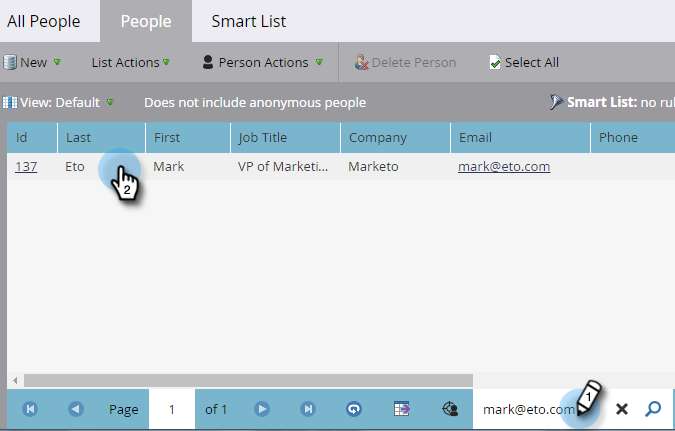
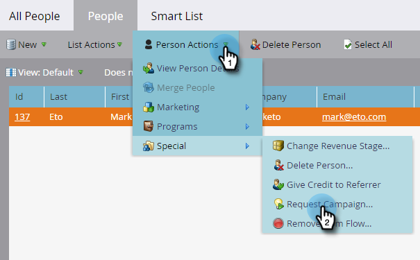

# Demander une campagne {#request-campaign}

Vous pouvez placer des personnes dans une campagne spécifique à l’aide de l’étape de flux unique « [!UICONTROL Demander la campagne] ».

>[!NOTE]
>
>La campagne dans laquelle vous placez la personne doit être active et comporter le déclencheur [La campagne est demandée](/help/marketo/product-docs/core-marketo-concepts/smart-campaigns/using-smart-campaigns/setting-up-a-trigger-smart-campaign-for-sales-using-campaign-is-requested.md){target="_blank"}.

1. Dans la **[!UICONTROL Base de données]**, recherchez et sélectionnez la ou les personnes souhaitées.

   

1. Cliquez sur **[!UICONTROL Actions de la personne]**, survolez **[!UICONTROL Spécial]**, puis sélectionnez **[!UICONTROL Demander la campagne]**.

   

1. Sélectionnez la campagne dans laquelle la personne doit être placée et cliquez sur **[!UICONTROL Exécuter maintenant]**.

   

1. Dans le coin supérieur droit de l’écran, vous verrez quand c’est terminé. Cliquez sur **[!UICONTROL Afficher les résultats]**.

   

   Votre personne fait maintenant partie de la campagne demandée.

   

   Un travail génial !

>[!TIP]
>
>Utilisez le déclencheur ou le filtre « [!UICONTROL La campagne est demandée] » pour rechercher les personnes affectées par cette étape de flux.
