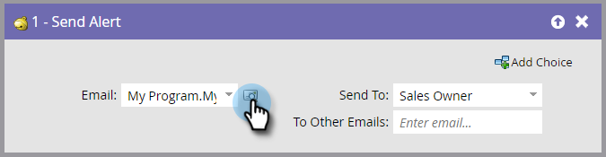

# Envoyer une alerte {#send-alert}

Marketo Engage peut envoyer une alerte par e-mail contenant des informations personnelles à n’importe qui : le commercial, un partenaire ou quelqu’un d’autre. Utilisez l’étape de flux « [!UICONTROL  Envoyer l’alerte ] ».

1. Recherchez et sélectionnez l’e-mail à envoyer.

   

   >[!NOTE]
   >
   >Votre alerte par e-mail doit contenir toutes les informations d’en-tête et présenter le statut **[!UICONTROL Approuvé]**.

1. Vous pouvez cliquer sur l’icône d’aperçu pour vous assurer d’avoir sélectionné l’e-mail approprié.

   

   >[!NOTE]
   >
   >Veillez à utiliser le jeton « [!UICONTROL  Envoyer les informations d’alerte ] » dans votre e-mail.

1. Sélectionnez le destinataire de l’alerte. Vous pouvez choisir [!UICONTROL Propriétaire de ventes] ou [!UICONTROL Propriétaire de compte].

   

1. Vous pouvez éventuellement ajouter d’autres adresses e-mail de votre choix (séparées par une virgule ou un point-virgule).

   

   >[!TIP]
   >
   >Dans les campagnes de déclenchement, vous pouvez utiliser des jetons dans **[!UICONTROL Vers d’autres e-mails]** tels que `{{lead.Territory Owner}}` ou `{{my.Alert Recipient}}`, tant que les valeurs sont des adresses e-mail valides. Les jetons dans **[!UICONTROL Vers d’autres e-mails]** ne fonctionneront pas dans une campagne par lots.

>[!MORELIKETHIS]
>
>[Créer un e-mail](/help/marketo/product-docs/email-marketing/general/creating-an-email/create-an-email.md){target="_blank"}
